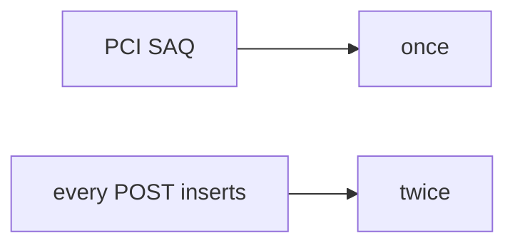

# E3-LO-07 — Transfer: health append-only audit

**Kind:** transfer-challenge
**Loop step:** 7 Transfer
**Standards:** ASVS `v5.0.0-2.3.4`. PCI 4.0.1 awareness not scope.

## Change the workplace; keep a processor sticker from meaning the ledger is once

Do not answer with a Top 10 / CWE / scanner as the definition of security.

**Prompt:** Health record append-only audit. Also name a simulated copay.

**Product sketch:** EHR-lite “Stripe idempotency is on so retries are fine,” plus “we have a PCI SAQ so high-assurance is done.”

Rewrite the SecureCollab sentence. Include:

1. attacker capabilities (504 retry / double-click — not a live clinic processor attack);
2. trust assumptions (key identity is TCB; Stripe/PCI are not);
3. forbidden outcome (two `k1` → count 2, not “HIPAA”);
4. a test idea on a **local** fixture only (no live Stripe);
5. residual (new key each click, webhook race, `v5.0.0-13.1.2` Level 3);
6. WCAG if confirmations trap users into retry.

## Mental model: SAQ vs once

## What graders reject

| Reject | Why |
|---|---|
| “we have Stripe” | Their side, not your count |
| Live processor / PAN tutorial | Lab policy |
| “PCI so 2.4 is done” | Awareness / scope, not this cell |

## Practice

One page. No keys. `labs/E3/e3-lab` is the only running system you may break.
