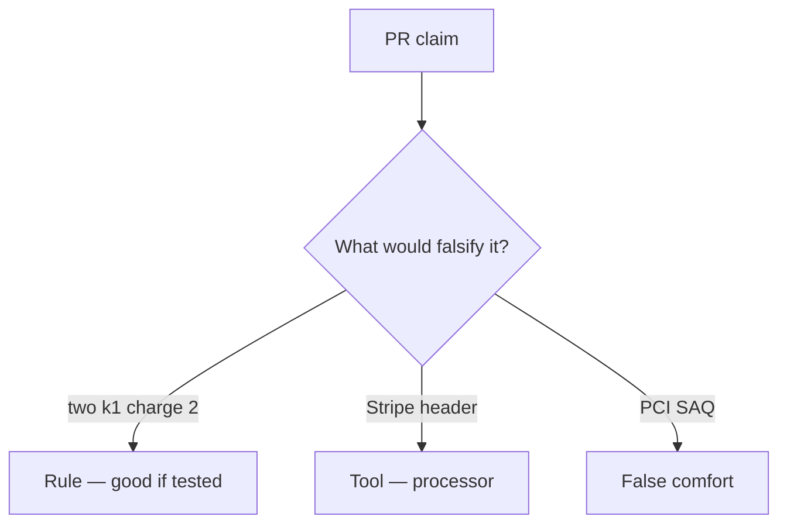

# Review always-append capture like a pull request

**Kind:** code-review
**Loop step:** Review

Intended findings live only in the answer-key folder — not here. Do not open that file until your review has been evaluated.

## What you are reviewing

A colleague ships the notes app's simulated copay. Review `labs/E3/e3-lab/vulnerable/` as that change. Your job is not to count suspicious lines. Reconstruct whether two `capture("k1")` still leave count 2, compare that with the rule, and write changes a developer can verify.

The check you already ran (`test_duplicate_capture_does_not_double_charge`) is the rule test. A comment “will add SEEN later” is not.

## Picture: two capture(k1) charge twice

Start with this seeded smell: **two capture(k1) charge twice**. Label it rule, tool, or false comfort before you accept the change.

Classification starts at the protected effect (two k1 → count 1). Everything that is not key identity at that call is a candidate always-append path. A questionnaire screenshot without that pytest is the same smell, not a different finding class.

Webhook races are leftover. New keys per click are leftover. Do not skip `test_duplicate_capture_does_not_double_charge`. Do not claim a course gate. Do not hit a live processor to prove the finding. Do not invent card numbers.

## Problems to find (name them yourself)

- two capture(k1) charge twice
- card-number-like strings
- Webhook vs capture race ignored
- Card-network scope claimed from this practice

Also reject: live processors; shipping without re-running `test_duplicate_capture_does_not_double_charge`; keys in lessons; claiming a course gate or card-network scope.

## Common mix-ups

- A filled-in questionnaire is this cell
- Processor remembering is the local ledger
- A new key on each retry is fine
- HTTP 200 is once
- This practice is in card-network scope

## Practice

Write three review notes a maintainer could act on. Each note: what you saw, rule or false comfort, suggested structural change, leftover you will **not** delete. Tie at least one to `test_duplicate_capture_does_not_double_charge`.

## Use it somewhere new

Clinic change that “added a payment company and a questionnaire PDF” without a duplicate-key deny is an incomplete ledger review. Name the independent falsehood that would still keep two k1 from charging twice.

## What this page is not doing

Do not merge by adding a comment “will add SEEN later.” That comment is leftover without an owner. Do not charge a public store to prove the finding.
