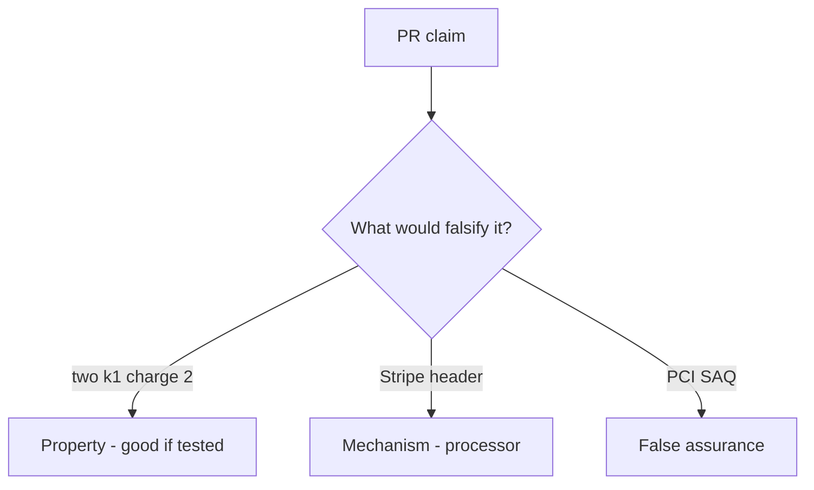

# E3-LO-08 — Review always-append capture as a PR

**Kind:** code-review
**Loop step:** Review
**Standards:** ASVS `v5.0.0-2.3.4`. PCI 4.0.1 awareness not scope.

## Review the fixture as if it were SecureCollab’s simulated copay

Review `labs/E3/e3-lab/vulnerable/` as a SecureCollab PR. Your job is not to count suspicious lines. Reconstruct whether two `capture("k1")` still leave count 2, compare that with the module invariant, and write changes a developer can verify.

Intended findings live only in `content/assessment/keys/E3.md` — not here. Do not open the keys file until your review has been evaluated.

## Mental model: two capture(k1) charge twice

Start with this seeded smell: **two capture(k1) charge twice**. Label it property, mechanism, or false assurance before you accept the PR.

Classification starts at the protected effect (two k1 → count 1). Everything that is not key identity at that call is a candidate always-append path. A SAQ screenshot without that pytest is the same smell, not a different finding class.

Webhook races are residual. New keys per click are residual. Do not skip `test_duplicate_capture_does_not_double_charge`. Do not claim Gate 7. Do not hit a live processor to prove the finding. Do not invent PAN.

## Seeded smells (label them yourself)

- two capture(k1) charge twice
- PAN-like strings
- Webhook vs capture race ignored
- PCI claimed from this lab

Also reject: live processors; shipping without re-running `test_duplicate_capture_does_not_double_charge`; keys in lessons; claiming Gate 7 or PCI scope.

## Misconceptions this module refuses

- PCI SAQ is this cell
- Stripe idempotency is the local ledger
- A new key on each retry is fine
- HTTP 200 is once
- This lab is in PCI scope

## Practice

Write three review notes a maintainer could act on. Each note: observation, property or false assurance, suggested structural change, residual you will **not** delete. Tie at least one to `test_duplicate_capture_does_not_double_charge`.

## Transfer

Clinic PR that “added Stripe and a SAQ PDF” without a duplicate-key deny is an incomplete ledger review. Name the independent falsehood that would still keep two k1 from charging twice.

## Non-goals

Do not merge by adding a comment “will add SEEN later.” That comment is a residual without an owner. Do not charge a public store to prove the finding.
