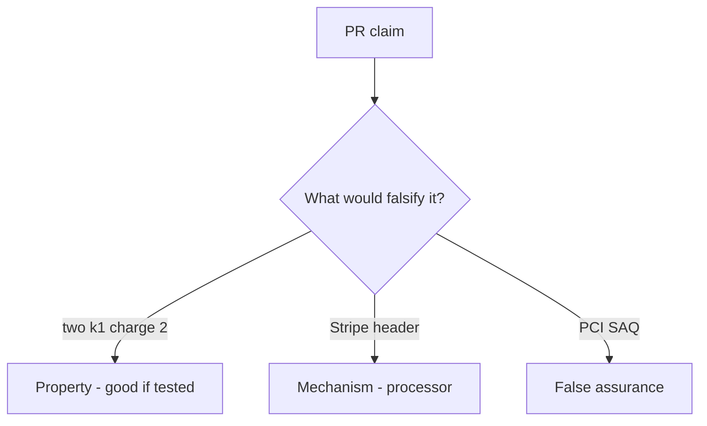

# E3-LO-08 — Review always-append capture as a PR

**Kind:** code-review
**Loop step:** Review
**Standards:** ASVS `v5.0.0-2.3.4`. PCI 4.0.1 awareness not scope.

## Review the fixture as if it were SecureCollab’s simulated copay

Review `labs/E3/e3-lab/vulnerable/` as a SecureCollab PR. Intended findings live only in `content/assessment/keys/E3.md` — not here.

## Mental model: property, mechanism, or false assurance

Seeded smells (label them yourself; do not open the keys file):

- two capture(k1) charge twice
- PAN-like strings
- Webhook vs capture race ignored
- PCI claimed from this lab

Also reject: live processors, keys in lessons, claiming Gate 7 or PCI scope.

## Misconceptions

- PCI SAQ is this cell
- Stripe idempotency is the local ledger
- A new key on each retry is fine

## Practice

Write three review notes. Tie at least one to `test_duplicate_capture_does_not_double_charge`.

## Transfer

Clinic PR that “added Stripe and a SAQ PDF” without a duplicate-key deny is incomplete.
