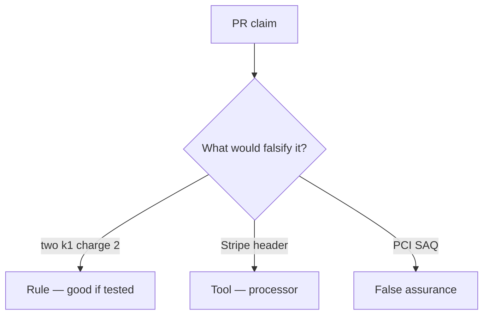

# Would you merge this always-append capture?

**Kind:** code-review
**Loop step:** Review

## What you are reviewing

Review `labs/E3/e3-lab/vulnerable/` as a change to the notes app's simulated copay. Check whether two `capture("k1")` still leave count 2.

A comment “will add SEEN later” is not a pass on `test_duplicate_capture_does_not_double_charge`.

## Picture: two capture(k1) charge twice

**two capture(k1) charge twice**.

Two k1 still have to count as 1. If the change never checks key identity, that always-append leftover is still open. A questionnaire screenshot does not replace that check.

Webhook races are leftover. New keys per click are leftover. Do not skip `test_duplicate_capture_does_not_double_charge`. Do not claim a course gate. Do not hit a live processor to prove the finding. Do not invent card numbers.

## Problems to find (name them yourself)

- two capture(k1) charge twice
- card-number-like strings
- Webhook vs capture race ignored
- Card-network scope claimed from this practice

Also reject: live processors; shipping without re-running `test_duplicate_capture_does_not_double_charge`; keys in lessons; claiming a course gate or card-network scope.

## Common mix-ups

- A filled-in questionnaire is this rule
- Processor remembering is the local ledger
- A new key on each retry is fine
- HTTP 200 is once
- This practice is in card-network scope

## Use it somewhere new

Clinic change that “added a payment company and a questionnaire PDF” without a duplicate-key deny is an incomplete ledger review. Name the independent falsehood that would still keep two k1 from charging twice.

## What this page is not doing

Do not merge by adding a comment “will add SEEN later.” That comment is leftover without an owner. Do not charge a public store to prove the finding.
