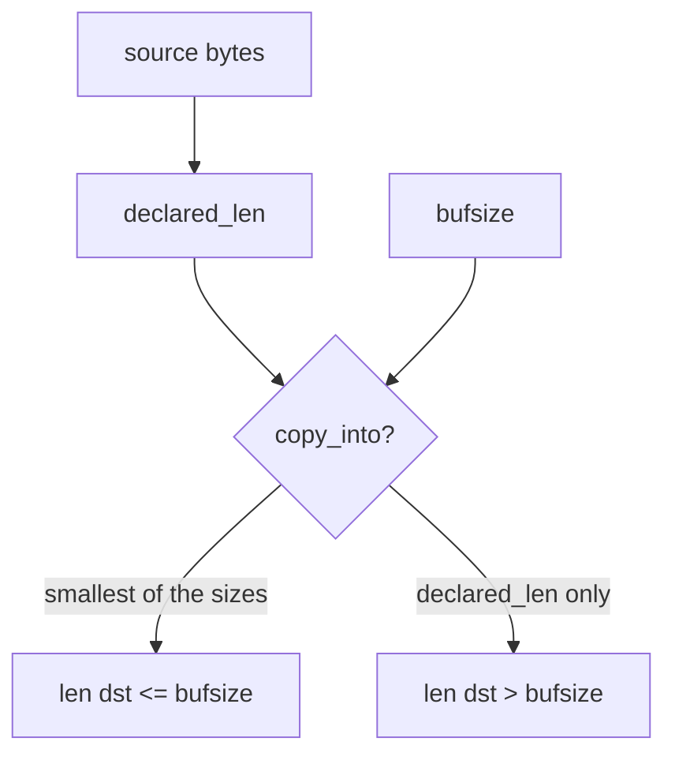
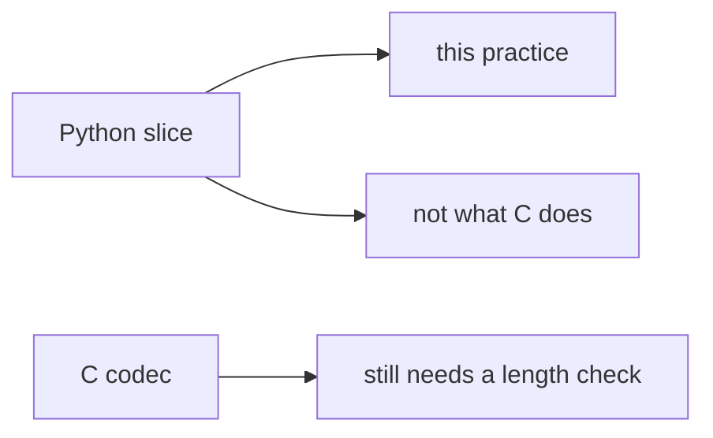

# The copy must fit the box

**Kind:** concept-model
**Loop step:** 1 Property

## The rule

The notes app unpacks files and copies bytes into a destination. **Integrity of the buffer** is whether the copy length is checked on every path. Checking every path — textbooks call this complete mediation — here means every copy is bounded by the destination size. Length is that check for the buffer. A header `declared_len` is untrusted input, the same class as a JSON field that names a workspace.

> `copy_into(4, b"abcdefgh", 4)` must return a destination whose length is at most 4. A short honest copy may fit.

What must not happen is **a copy that exceeds the destination**. This elective is a Python length stand-in. It is not a C exploit course.

Manufacturer guidance that tells a company to prefer memory-safe languages is not the lab check. Industry checklists want unstructured data handled so it does not become an unexpected overwrite. Native unpackers and leftover C codecs are leftover risk, later and harder — not this pytest. Do not invent a “memory safety” chapter id as the rule.

## Picture: destination size is the rule



Who can act: someone who controls a file header length. What you trust: a local `copy_into(bufsize, src, declared_len)` that bounds the copy by destination size. Do not compile a native overflow.

**A tool is not the rule.** “We use Kotlin,” a sanitizer in CI, or an awareness-list dashboard is not this sentence.

## Picture: language marketing is not the copy



A Python slice in this practice is a teaching stand-in. C will not do this for you. Calling a helper from another language still needs the same length check next to the copy.

## Why it happens, what it costs, how you stop it, how you notice, how you recover

| Slice | For this rule |
|---|---|
| Why it happens | Declared length trusted over destination size |
| What has to be true first | `copy_into` copies `declared_len` plus 8 |
| Trigger | Header claims 4; payload is 8 |
| What it costs | The destination object is overwritten in space |
| How you stop it | `min(bufsize, declared_len, len(src))` |
| How you notice | `copy_length_denied` |
| How you recover | Reject the blob; patch the parser; do not ship the overflowed binary |

## What the framework does vs what you still have to check

Python slicing will not save a C copy. A memory-safe language reduces this class of overwrite **in that language**. Helpers that call C, and leftover codecs, still copy. The app’s promise is: **this** practice, length ≤ 4.

## What the tool cannot do

- Three-way min in Python does not prove a C codec.
- Integer wrap of `n` before the min is leftover risk.
- Use-after-free and other time bugs are out of this practice.
- A company language roadmap is organizational advice, not `copy_into`.

## Practice

Name destination size, declared length, and source length. Then run:

```text
python3 -m pytest labs/E4/e4-lab/tests --impl vulnerable
python3 -m pytest labs/E4/e4-lab/tests --impl fixed
```

The first command must fail. The second must pass.

Parser error messages must be readable without dumping file bytes. Operators should be able to read “copy exceeds destination” without a hex dump.

## Use it somewhere new

Clinic DICOM / image parser. Protobuf C extension.

## What this page is not doing

Weaponized native exploits. An awareness list as the syllabus. Course gates from this page. Answer keys are not on this site.
