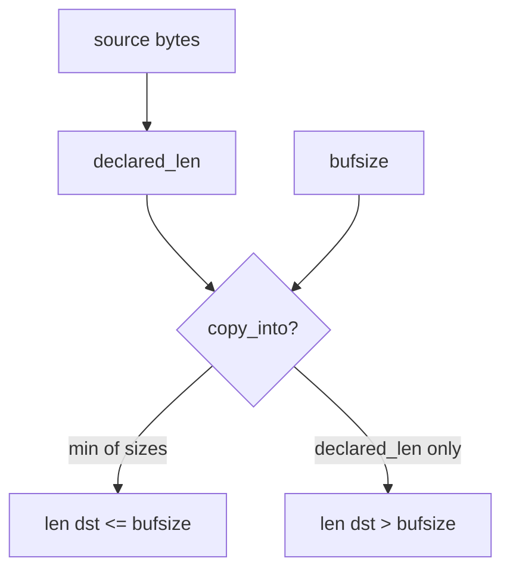
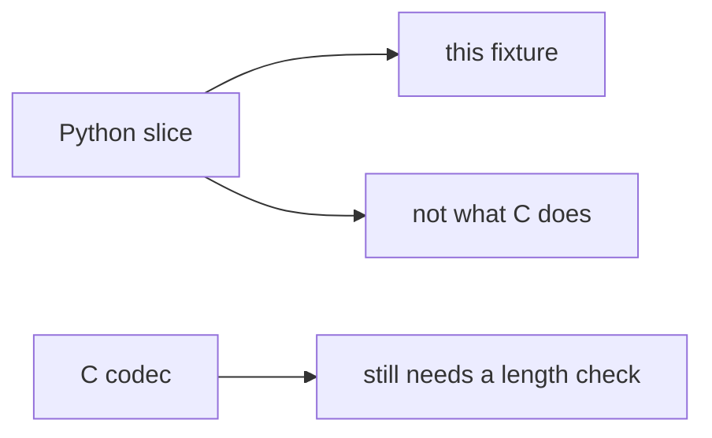

# E4-LO-01 — Copied bytes never exceed the destination buffer

**Kind:** concept-model
**Loop step:** 1 Property
**Standards:** CISA Case for Memory Safe Roadmaps (2023-12-06, guidance). ASVS `v5.0.0-5.3.1` related; `v5.0.0-5.3.3` is **Level 3, advanced**. CWE-119 / CWE-787 are **awareness after** the length cause.

## The claim this module owns

SecureCollab unpackers and FFI helpers copy bytes into a destination. **Integrity of the buffer object** is whether the copy length is mediated by destination capacity. A header `declared_len` is untrusted input, the same class as a JSON `workspace_id`.

> `copy_into(4, b"abcdefgh", 4)` must return a destination whose length is at most 4. A short honest copy may fit.

The forbidden outcome is **a copy that exceeds the destination**. This elective is a Python length stand-in. It is not a C exploit course.

CISA's Case for Memory Safe Roadmaps is **manufacturer guidance** for language and FFI plans, not the lab oracle. ASVS `v5.0.0-5.3.1` (stable, related) wants unstructured data handled so it does not become an unexpected execution or overwrite path. `v5.0.0-5.3.3` (native unpacker / archive residual) is **Level 3, advanced**. Do not invent an ASVS "memory safety" chapter ID.

## Mental model: destination size is the invariant



## Mental model: language marketing is not the copy



**Mechanism (not the property):** "we use Kotlin," ASAN in CI, a CWE Top 25 dashboard.

## Root cause vs impact vs prevention vs detection vs recovery

| Slice | For this property |
|---|---|
| Root cause | Declared length trusted over destination size |
| Preconditions | `copy_into` copies `declared_len` plus slack |
| Trigger | Header claims 4; payload is 8 |
| Impact | Spatial overwrite of the destination object |
| Prevention | `min(bufsize, declared_len, len(src))` |
| Detection | `copy_length_denied` |
| Recovery | Reject the blob; patch the parser; do not ship the overflowed binary |

## Framework defaults versus the copy guarantee

Python slicing will not save a C `memcpy`. A memory-safe language reduces CWE-119 **in that language**. FFI and leftover codecs still copy.

## Mechanism limits

- Three-way min in Python does not prove a C codec.
- Integer wrap of `n` before the min is a residual.
- Temporal bugs (use-after-free) are out of this lab.
- CISA roadmap is organizational, not `copy_into`.

## Usability and accessibility

Parser error messages must be readable without dumping payload bytes (WCAG 2.2 for operator UI; 3.1 for logs).

## Practice

Name destination, declared length, and source length. Then run:

```
python3 -m pytest labs/E4/e4-lab/tests --impl vulnerable
python3 -m pytest labs/E4/e4-lab/tests --impl fixed
```

The first command must fail. The second must pass.

## Transfer

Clinic DICOM / image parser. Protobuf C extension.

## Residual risk

FFI; integer wrap; existing C codecs (6.4). `v5.0.0-5.3.3` Level 3 native unpacker residual.

## Non-goals

Weaponized native exploits. CWE Top 25 as the syllabus. Gate 7 / M2.
