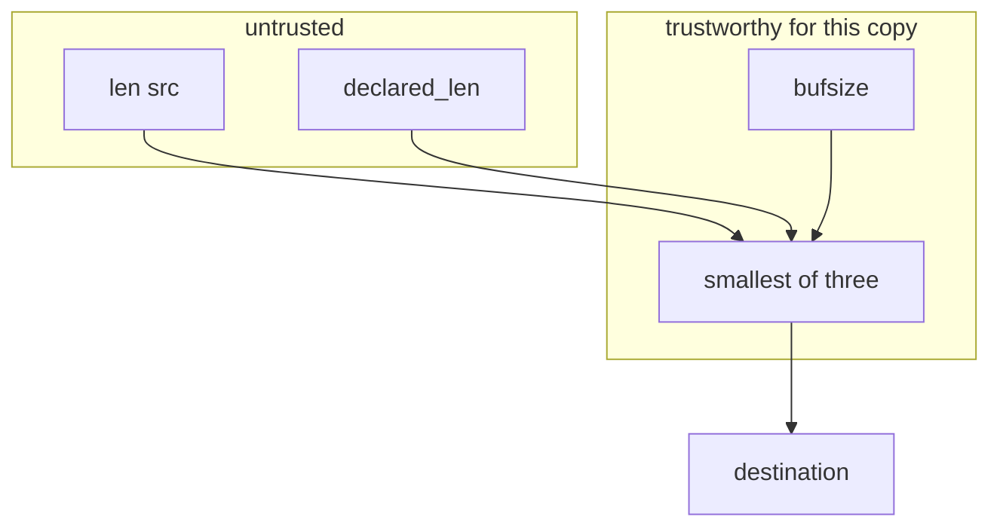
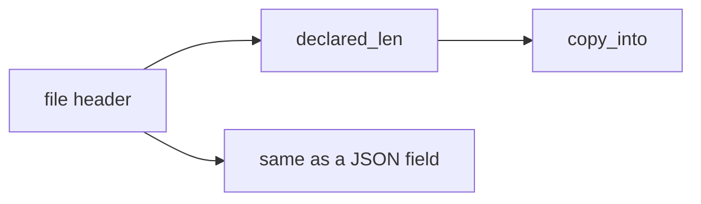

# Destination vs declared length

**Kind:** design-exercise
**Loop step:** 2 Model

## Could someone else name the length check from your unpacker map?

“We wrote it in Python” is not this page. A reviewable model names **bufsize, declared_len, len(src), who may set each, and the copy site**.

This week on the notes app: local `copy_into(bufsize, src, declared_len)`. No native overflow walkthrough.

## Picture: three numbers, one destination

If the copy is not the smallest of destination size, declared length, and source length, deny growth past the box.

## Picture: the header is input

A header length is data. Treat it like any other field the requester sent.

## Step 1: name who, what, and the copy

| Piece | This system |
|---|---|
| Who | Hostile header; caller from another language |
| What | Destination buffer of size 4 |
| Actions | `copy_into` |
| Paths | Declared length; source bytes |
| What you trust | Smallest of three lengths at the copy |
| What you do not trust | `declared_len`; `len(src)` |
| State / time | Destination after copy; check at copy, not only at parse |
| The rule | Integrity of the buffer object |

## Step 2: write rows the lab can fail

| Who | What | Action | Decision |
|---|---|---|---|
| header | dest | copy `declared_len` only | deny if > bufsize |
| parser | dest | copy smallest of three | allow |
| caller from another language | dest | skip dest check | deny |
| “Kotlin app” | C codec | treat as bounded | deny |

## Practice

Open `copy.py` in `labs/E4/e4-lab`.

## Use it somewhere new

Clinic DICOM parser: the header length is still untrusted at the native codec.

## What can still go wrong

Integer wrap; time bugs (use-after-free); two parsers that disagree on length.

## What this page is not doing

An awareness list as the definition of security. Answer keys are not on this site.
