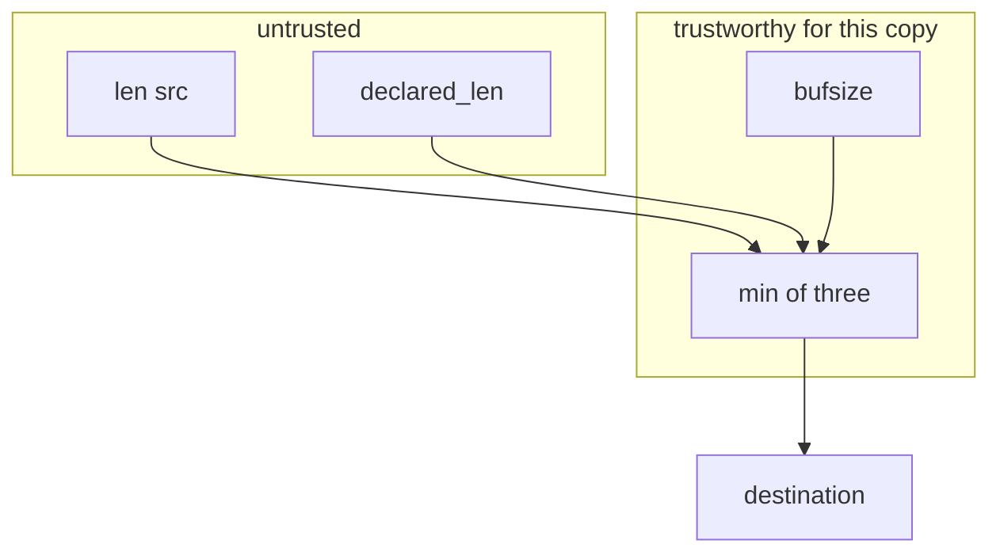
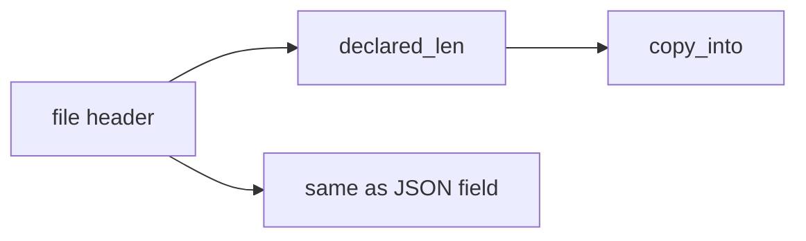

# E4-LO-02 — Destination vs declared length vs source length

**Kind:** design-exercise
**Loop step:** 2 Model
**Standards:** ASVS `v5.0.0-5.3.1`. CISA memory-safe roadmaps as guidance.

## Can a second engineer name the length check from your unpacker map?

"We wrote it in Python" is not this lesson. A reviewable model names **bufsize, declared_len, len(src), who may set each, and the copy site**.

SecureCollab freeze: local `copy_into(bufsize, src, declared_len)`. No native overflow PoC.

## Mental model: three numbers, one destination

## Mental model: header is input

## Step 1: freeze pieces

| Piece | This system |
|---|---|
| Subjects | hostile header; FFI caller |
| Objects | destination buffer of size 4 |
| Actions | `copy_into` |
| Channels | declared length; source bytes |
| TCB | three-way min at copy |
| Untrusted | `declared_len`; `len(src)` |
| State / time | destination after copy; check at copy not only at parse |
| 1.1 cell | integrity of the buffer object |

## Step 2: write cells

| Subject | Object | Action | Decision |
|---|---|---|---|
| header | dest | copy declared_len only | deny if > bufsize |
| parser | dest | copy min of three | allow |
| FFI | dest | skip dest check | deny |
| "Kotlin app" | C codec | treat as bounded | deny |

## Practice

Draw the map. Point at `labs/E4/e4-lab` file `copy.py`.

## Transfer

Clinic DICOM parser: the header length is still untrusted at the native codec.

## Residual risk

Integer wrap; temporal safety; parser differentials.

## Non-goals

Top 25 as the definition of security. Keys stay out of lessons.
