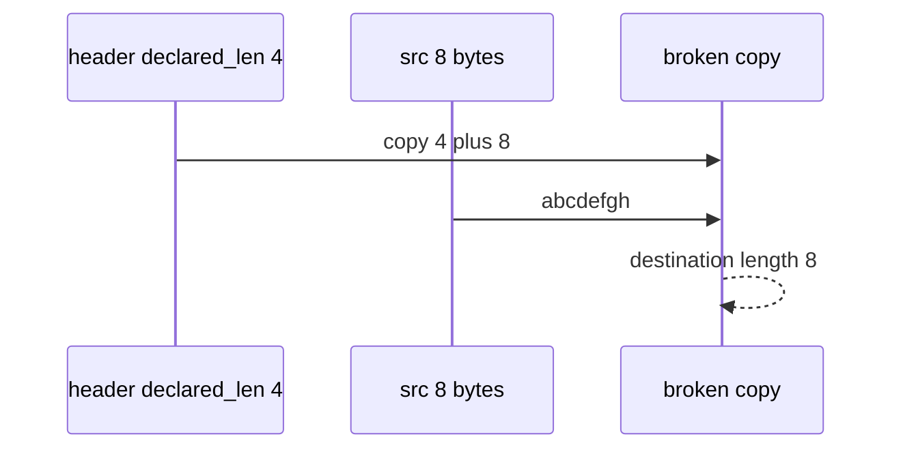

# Practice: declared_len plus 8

**Kind:** mechanism-lab
**Loop step:** 3 Break

## Try it

The practice is not a website you attack. `copy_into(bufsize, src, declared_len)` does not compile a C overflow, spray a heap, or fuzz a third-party binary. The copy uses `declared_len` plus 8, so the extra eight bytes are already past the buffer you named.

> `len(copy_into(4, b"abcdefgh", 4))` must be ≤ 4. A short honest copy may fit. Checking every path here means the copy is bounded by destination size.

## Where you may practice

Stay inside `labs/E4/e4-lab`. Fake bytes: `abcdefgh`. Restore the broken and repaired folders when you are done.

Do not compile a C overflow. Do not spray a heap. Do not fuzz a third-party binary, an employer codec, or anyone else’s unpacker.

What must not happen: copy into a 4-byte lab buffer returns more than 4 bytes. `len(copy_into(4, b"abcdefgh", 4)) > 4`.

Picture a hostile header `declared_len` — “the app is mostly Kotlin so copies are safe,” a sanitizer in CI treated as the rule, or an awareness-list mapping treated as this rule. `copy_into` bounds the copy by **destination size** — not Python slicing, a company language roadmap, or FastAPI.

## Picture: extra eight bytes are not a gift



The broken files copy `src[: declared_len + 8]`. For an 8-byte source that is the whole buffer — longer than `bufsize` 4. Do not treat the `+ 8` as a C exploit size. Declared length is trusted over destination size. You do not need a compiler. You must not ship a native walkthrough.

An earlier topic already said path length is checking every path for *which file*. This rule is **spatial length at the copy**. This page does not finish a check-in.

## What to look at: the cause, not a hunt

`vulnerable/copy.py` returns more than `bufsize` bytes. Checks:

- `test_copy_does_not_exceed_buffer`
- `test_short_copy_may_fit` — short honest copy may pass on both

## Why it happens, what it costs, how you stop it, how you notice, how you recover

| Slice | This practice |
|---|---|
| The rule | `len(copy_into(4, b"abcdefgh", 4)) <= 4` |
| Why it happens | Declared length trusted over destination size |
| What's already wrong | Copy uses `declared_len` plus 8 |
| Trigger | Header claims 4; payload is 8 |
| What it costs | Destination longer than bufsize |
| How you stop it | `min(bufsize, declared_len, len(src))` |
| How you notice | `copy_length_denied`; never file bytes |
| How you recover | Reject the blob; patch the parser |
| Not the lesson | A C exploit, an awareness-list dashboard, or this memory lesson as a finished check-in |

## What the framework does vs what you still have to check

Python slicing will not save a C copy. A memory-safe language reduces this overwrite class **in that language**. Helpers that call C, and leftover codecs, still copy. Length ≤ 4.

## Practice

```text
python3 -m pytest labs/E4/e4-lab/tests --impl vulnerable
```

Run from `labs/E4/e4-lab` if a repo-root collection picks up `site/`. Do not compile native walkthroughs. A setup error is not proof the rule holds.

## Use it somewhere new

An image parser can copy past the native buffer. Predict the oversize copy without leaving this directory. Do not fuzz a third-party codec.

## What this page is not doing

No public-binary, production-unpacker, or weaponized overflow instructions. This page does not finish a check-in. An awareness-list name stays awareness after the cause.
