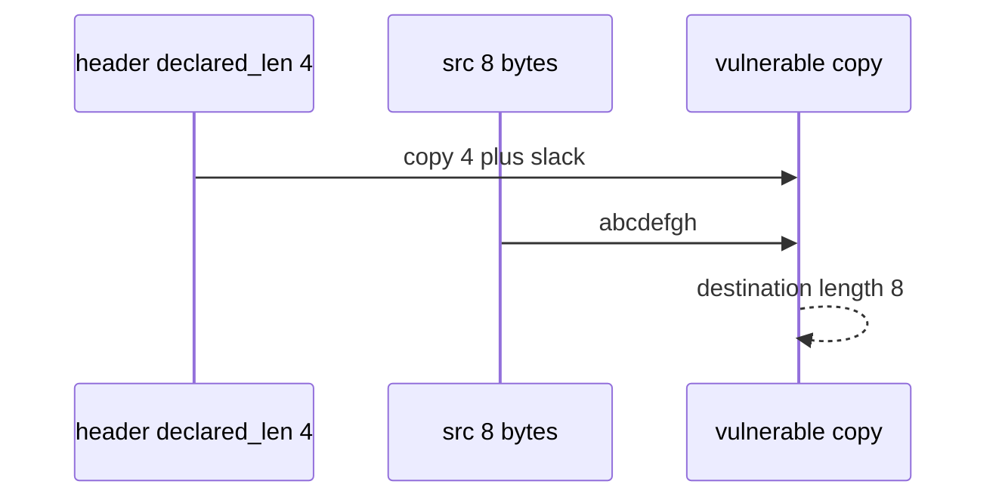

# E4-LO-03 — Observe declared_len plus slack, do not compile overflows

**Kind:** mechanism-lab
**Loop step:** 3 Break
**Standards:** CISA Case for Memory Safe Roadmaps (2023-12-06, guidance). ASVS `v5.0.0-5.3.1` related. `v5.0.0-5.3.3` native unpacker residual is **Level 3, advanced**. CWE-119 / CWE-787 are **awareness after** the length cause. Lab policy: local only. No native exploits.

## Authorized scope

`labs/E4/e4-lab` only. The fixture is an in-process `copy_into(bufsize, src, declared_len)`. Synthetic `abcdefgh` bytes. Do **not** compile a C overflow, spray a heap, or fuzz a third-party binary as the exercise.

**Forbidden outcome:** Copy into a 4-byte lab buffer returns more than 4 bytes. `len(copy_into(4, b"abcdefgh", 4)) > 4`.

Attacker capability in this lab: a hostile header `declared_len`. That stands in for “the app is mostly Kotlin so copies are safe,” ASAN in CI treated as 1.2, or a CWE-119 mapping treated as this cell. Trust assumption: `copy_into` is supposed to bound the copy by **destination capacity**. Python slicing, a CISA roadmap, and FastAPI are not in the TCB for this cell.

## Mental model: extra eight bytes are not a gift



`--impl vulnerable` copies `src[: declared_len + 8]`. For an 8-byte source that is the whole buffer — longer than `bufsize` 4. Do not treat the `+ 8` as a C exploit size. Preconditions: declared length is trusted over destination size. You do not need a compiler. You must not ship a native PoC.

CISA's Case for Memory Safe Roadmaps is **manufacturer guidance**, not the lab oracle. Module 6.4 already said path length is mediation; this cell is **spatial length at the copy**. Gate 7 and M2 stay **not-attempted**.

## What to read in the fixture

`vulnerable/copy.py` returns more than `bufsize` bytes. Tests:

- `test_copy_does_not_exceed_buffer`
- `test_short_copy_may_fit` — short honest copy may pass on both

You do not need a new source. The failure of `test_copy_does_not_exceed_buffer` *is* the evidence.

Do not open the fixed tree yet. Diagnose the cause first.

## Root cause vs impact vs prevention vs detection vs recovery

| Slice | This lab |
|---|---|
| Required property | `len(copy_into(4, b"abcdefgh", 4)) <= 4` |
| Root cause | Declared length trusted over destination size |
| Preconditions | copy uses declared_len plus slack |
| Trigger | Header claims 4; payload is 8 |
| Impact | Destination longer than bufsize |
| Prevention | `min(bufsize, declared_len, len(src))` |
| Detection | `copy_length_denied`; never payload bytes |
| Recovery | Reject the blob; patch the parser |
| Not the lesson | A C exploit; CWE dashboard; Gate 7 complete |

## Framework defaults versus the copy guarantee

Python slicing will not save a C `memcpy`. A memory-safe language reduces CWE-119 **in that language**. FFI and leftover codecs still copy. The application guarantee is: **this** fixture, length ≤ 4.

## Practice

```text
python3 -m pytest labs/E4/e4-lab/tests --impl vulnerable
```

Run from `labs/E4/e4-lab` if a repo-root collection picks up `site/`. Record `test_copy_does_not_exceed_buffer`. Do not compile native PoCs. An environment error is not security evidence.

## Transfer

Clinic image parser: predict the oversize copy without leaving this directory. Do not fuzz a third-party codec.

## Non-goals

No public-binary, production-unpacker, or weaponized overflow instructions. Do not claim Gate 7. CWE-119 stays awareness after the cause.
