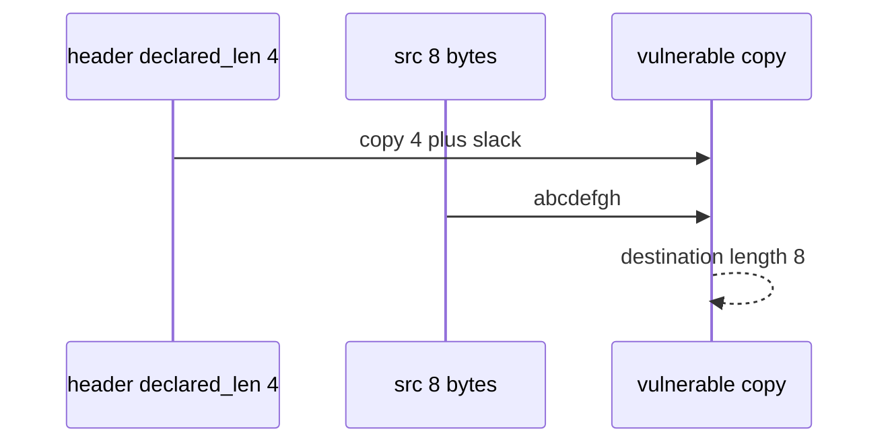

# E4-LO-03 — Observe declared_len plus slack, do not compile overflows

**Kind:** mechanism-lab
**Loop step:** 3 Break
**Standards:** CISA memory-safe roadmaps (guidance). Lab policy: local only. No native exploits.

## Authorized scope

`labs/E4/e4-lab` only. Synthetic `abcdefgh` bytes. Do **not** compile a C overflow, spray a heap, or fuzz a third-party binary as the exercise.

**Forbidden outcome:** Copy into a 4-byte lab buffer returns more than 4 bytes.

## Mental model: extra eight bytes are not a gift



`--impl vulnerable` copies `src[: declared_len + 8]`. For an 8-byte source that is the whole buffer — longer than `bufsize` 4. Do not treat the `+ 8` as a C exploit size.

## What to read in the fixture

`vulnerable/copy.py` returns more than `bufsize` bytes. Tests require `len(copy_into(4, b"abcdefgh", 4)) <= 4`.

## Root cause vs impact

| Slice | Lab |
|---|---|
| Root cause | Declared length trusted over destination size |
| Impact | Destination longer than 4 |
| Not the lesson | A C exploit or CWE-119 product as the definition |

## Practice

```
python3 -m pytest labs/E4/e4-lab/tests --impl vulnerable
```

Record `test_copy_does_not_exceed_buffer`. Do not compile native PoCs.

## Transfer

Clinic image parser: predict the oversize copy without leaving this directory.

## Non-goals

No public-binary, production-unpacker, or weaponized overflow instructions.
