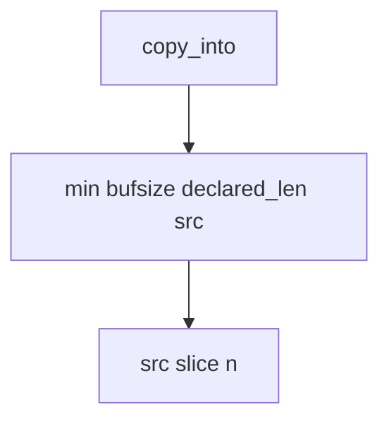

# Bound the copy by the smallest of three lengths

**Kind:** design-exercise
**Loop step:** 4 Build

## The rule

`copy_into` must return `src[:n]` where `n = min(bufsize, declared_len, len(src))`. Fail closed: a lying header cannot grow the destination. A memory-safe language may *accompany* this check; it does not replace it when you call C. Structural means that min — not “we use Kotlin,” not a sanitizer, not an awareness-list dashboard.

The check in unpackers: declared 4, src 8, buf 4 → length ≤ 4. Do not skip the deny because the language is Python. Do not treat `+ 8` slack as a feature.

Checking every path here means the copy site itself compares three numbers. A parse-time check that the copy later ignores is not enough.

## Picture: smallest of three is the gate



Do not accept “we use Python” as membership in the min. Integer wrap of size fields still has to be handled — a wrapped `n` is a lying min. Leftover C codecs (JNI, protobuf extensions) are sibling copies. Native unpackers and leftover C codecs stay leftover risk, later and harder — not this check.

A production unpacker should **fail closed** on header/source mismatch rather than silently truncate without an error the caller can handle. This lab returns a short copy as the smallest trustworthy bound.

Unstructured data must not become an overwrite path — destination length.

## What the repaired files must show

| After the fix | Must be true |
|---|---|
| declared 4, src 8, buf 4 | length <= 4 |
| short declared 2, src ab | may copy `ab` |

## What this is not

A language rewrite. A sanitizer. An awareness-list dashboard. A course gate. Proof that a native unpacker is bounded. A company language roadmap marked complete.

## What can still go wrong

- Integer wrap of size fields can still beat a naive min.
- Leftover C codecs are not this Python practice.
- Time bugs (use-after-free) are a different grain.
- Silent truncate without an error is leftover of this smallest fix.
- Calling another language means the check must live next to the native copy.

## Practice

Name who can change `bufsize`. Run:

```text
python3 -m pytest labs/E4/e4-lab/tests --impl fixed
```

## Use it somewhere new

A JNI codec still has to deny a copy that exceeds the native buffer the same way.

## What this page is not doing

Do not compile a native overflow. Do not claim a course gate from a Kotlin rewrite. Do not present an awareness-list name as the syllabus.
