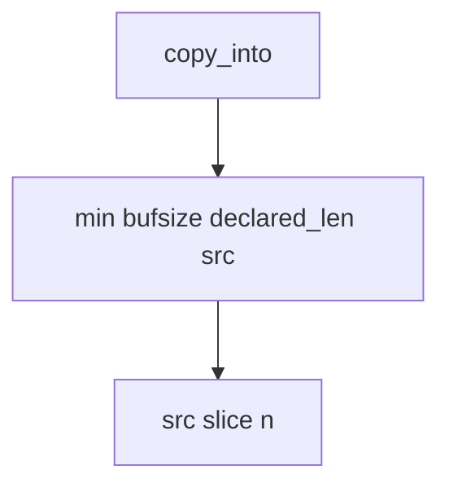

# E4-LO-04 — Bound the copy by the minimum of three lengths

**Kind:** design-exercise
**Loop step:** 4 Build
**Standards:** ASVS `v5.0.0-5.3.1`. CISA roadmaps remain guidance. `v5.0.0-5.3.3` is **Level 3, advanced**.

## Structural means the copy compares three numbers

`copy_into` must return `src[:n]` where `n = min(bufsize, declared_len, len(src))`. Fail-safe: a lying header cannot grow the destination. A memory-safe language may *accompany* this check; it does not replace it at FFI. Structural means that min — not “we use Kotlin,” not ASAN, not a CWE dashboard.

The smallest restore for SecureCollab unpackers is: declared 4, src 8, buf 4 → length ≤ 4. Do not fail open because the language is Python. Do not treat `+ 8` slack as a feature.

## Mental model: three-way min is the gate



Do not accept "we use Python" as membership in the min. Production still needs integer wrap of size fields to be handled — a wrapped `n` is a lying min. Leftover C codecs (JNI, protobuf extensions) are sibling copies. `v5.0.0-5.3.3` (native unpacker / archive residual) is Level 3 advanced.

A production unpacker should **fail closed** on header/source mismatch rather than silently truncate without an error the caller can handle. This lab returns a short copy as the smallest trustworthy bound.

ASVS `v5.0.0-5.3.1` wants unstructured data not to become an overwrite path. This pytest is that sentence for destination length.

## Why this restores the cell

| After the fix | Must be true |
|---|---|
| declared 4, src 8, buf 4 | length <= 4 |
| short declared 2, src ab | may copy `ab` |

## What this is not

Rust rewrite this week. ASAN. CWE dashboard. Gate 7 / M2. Native unpacker proof (`v5.0.0-5.3.3` Level 3 residual). CISA roadmap complete.

## Mechanism limits

- Integer wrap of size fields can still beat a naive min.
- Leftover C codecs are not this Python fixture.
- Temporal safety (use-after-free) is a different grain.
- Silent truncate without an error is a residual of this smallest fix.
- FFI means the check must live next to the native copy.

## Practice

Name who can change `bufsize`. Run:

```text
python3 -m pytest labs/E4/e4-lab/tests --impl fixed
```

Must pass. Run from the lab directory if collection at repo root is polluted.

## Transfer

Clinic JNI codec: deny a copy that exceeds the native buffer the same way.

## Residual risk

Integer wrap of size fields; leftover C codecs; temporal safety; `v5.0.0-5.3.3` Level 3.

## Non-goals

Do not compile a native overflow. Do not claim Gate 7 from a Kotlin rewrite. Do not present CWE-119 as the syllabus.
