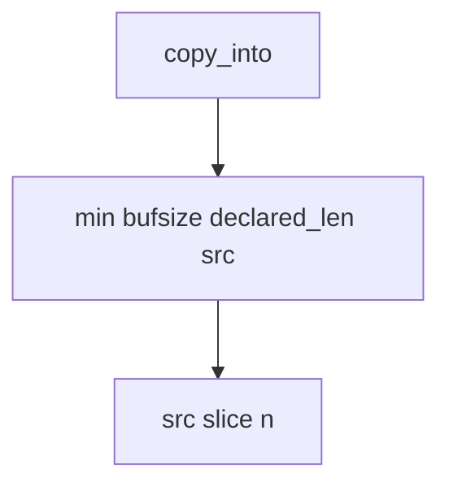

# E4-LO-04 — Bound the copy by the minimum of three lengths

**Kind:** design-exercise
**Loop step:** 4 Build
**Standards:** ASVS `v5.0.0-5.3.1`. CISA roadmaps remain guidance.

## Structural means the copy compares three numbers

`copy_into` must return `src[:n]` where `n = min(bufsize, declared_len, len(src))`. Fail-safe: a lying header cannot grow the destination. A memory-safe language may *accompany* this check; it does not replace it at FFI.

## Mental model: three-way min is the gate



Do not accept "we use Python" as membership in the min.

## Why this restores the cell

| After the fix | Must be true |
|---|---|
| declared 4, src 8, buf 4 | length <= 4 |
| short declared 2, src ab | may copy `ab` |

## What this is not

Rust rewrite this week. ASAN. CWE dashboard. Gate 7 / M2. Native unpacker proof (`v5.0.0-5.3.3` Level 3 residual).

A production unpacker should **fail closed** on header/source mismatch rather than silently truncate without an error the caller can handle. This lab returns a short copy as the smallest trustworthy bound.

## Practice

Name who can change `bufsize`. Run:

```
python3 -m pytest labs/E4/e4-lab/tests --impl fixed
```

Must pass.

## Transfer

Clinic JNI codec: deny a copy that exceeds the native buffer the same way.

## Residual risk

Integer wrap of size fields; leftover C codecs; temporal safety.
