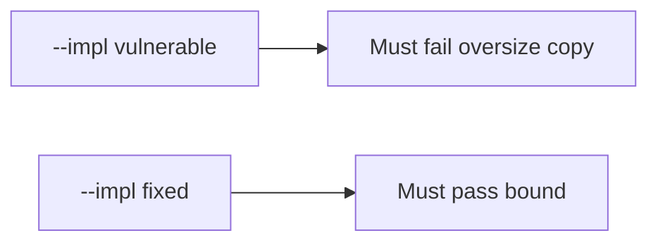

# E4-LO-05 — Evidence is oversize copy denied, then a passing pair

**Kind:** verification-lab
**Loop step:** 5 Verify
**Standards:** ASVS `v5.0.0-5.3.1`. CISA roadmaps as guidance, not the oracle.

## An invariant that cannot fail a test is still a slogan

"We use Kotlin" is not evidence. "ASAN is on" is a mechanism observation. The oracle is: `len(copy_into(4, b"abcdefgh", 4)) <= 4` and a short honest copy may fit. The oversize observation must be **false** on `--impl vulnerable` (length 8) and **true** on `--impl fixed`. Do not compile native exploits.

## Mental model: vulnerable must fail: oversize copy

The failing observation on `--impl vulnerable` is **oversize copy**. A passing collection count is not this cell.



| Mode | Must show for this module |
|---|---|
| Negative / abuse | `copy_into(4, b"abcdefgh", 4)` length <= 4; vulnerable must fail |
| Normal | short declared length may copy (may pass on both) |
| Not claimed | C PoC; CWE dashboard; Gate 7; integer wrap |

Lab tests in `labs/E4/e4-lab/tests/test_property.py`. `test_copy_does_not_exceed_buffer` is a **forbidden-outcome** test: declared_len-plus-slack is not allowed to count as a passing control.

```text
python3 -m pytest labs/E4/e4-lab/tests --impl vulnerable
python3 -m pytest labs/E4/e4-lab/tests --impl fixed
```

Honest `test_short_copy_may_fit` may pass on both implementations. That does not excuse the oversize deny test. If vulnerable does not fail `test_copy_does_not_exceed_buffer`, the lab is miswired—fix the wiring, not the assertion.

## What the tests do not prove

- A C codec is bounded (`v5.0.0-5.3.3` Level 3 residual)
- Integer wrap of `n` is impossible
- Temporal safety
- CISA roadmap complete
- Gate 7 / M2 complete

Record those as residuals or later modules, not as silent passes.

## Practice

Execute both implementations this session from the lab directory if needed. Write the fail/pass pair next to the matrix row. Reject a “test” that only greps `Kotlin` in a README without calling `copy_into(4, b"abcdefgh", 4)`.

## Transfer

Clinic: a test that only asserts "the language is memory-safe" is not this cell. A third-party binary is out of scope.

## Non-goals

Do not add a native-PoC trophy. Do not log payload bytes. Keys stay out of this file. Gate 7 stays not-attempted.
