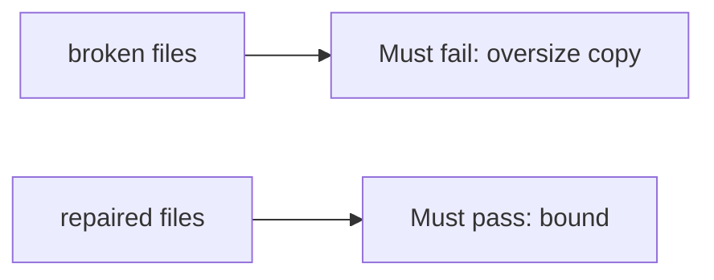

# The broken files must fail the oversize copy

**Kind:** verification-lab
**Loop step:** 5 Verify

## Until you can fail it, it is still a slogan

“We use Kotlin” is not this topic’s evidence. “A sanitizer is on” is a tool observation. The check is: `len(copy_into(4, b"abcdefgh", 4)) <= 4` and a short honest copy may fit. The oversize observation must be **false** on the broken files (length 8) and **true** on the repaired files. Do not compile native exploits.

## Picture: broken must fail the oversize copy

A check that only greps `Kotlin` in a README can still look green while `copy_into(4, b"abcdefgh", 4)` still returns 8 bytes.



| Mode | Must show for this topic |
|---|---|
| Wrong input / abuse | `copy_into(4, b"abcdefgh", 4)` length <= 4; broken files must fail |
| Normal | Short declared length may copy (may pass on both) |
| Not claimed | A C walkthrough; an awareness-list dashboard; a course gate; integer wrap |

The checks live in `labs/E4/e4-lab/tests/test_property.py`. `test_copy_does_not_exceed_buffer` is there so `declared_len` plus 8 cannot sneak through.

```text
python3 -m pytest labs/E4/e4-lab/tests --impl vulnerable
python3 -m pytest labs/E4/e4-lab/tests --impl fixed
```

Honest `test_short_copy_may_fit` may pass on both implementations. That does not excuse the oversize deny test. If the broken files do not fail `test_copy_does_not_exceed_buffer`, the lab is miswired — fix the wiring, not the check. A setup error is not proof the rule holds.

## What the tests do not prove

- A C codec is bounded (native unpacker leftover, later and harder)
- Integer wrap of `n` is impossible
- Time bugs (use-after-free)
- A company language roadmap is complete
- A course gate is complete

Record those as leftover or later topics, not as silent passes.

## Practice

Run both this session from the lab directory if needed. Write the fail/pass pair next to the matrix row. Reject a “test” that only greps `Kotlin` in a README without calling `copy_into(4, b"abcdefgh", 4)`.

## Use it somewhere new

A clinic example: a test that only asserts “the language is memory-safe” is not this rule. A third-party binary is out of scope.

## What this page is not doing

Do not treat a native overflow as a prize. Do not log file bytes. Answer keys are not on this site. This page does not finish a check-in.
