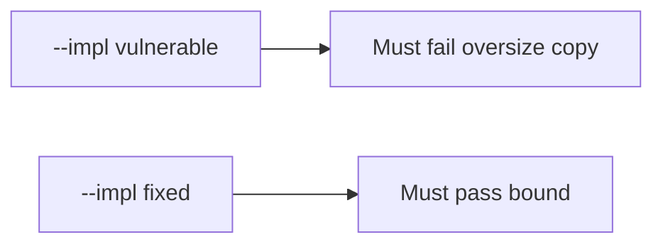

# E4-LO-05 — Evidence is oversize copy denied, then a passing pair

**Kind:** verification-lab
**Loop step:** 5 Verify
**Standards:** ASVS `v5.0.0-5.3.1`.

## An invariant that cannot fail a test is still a slogan

"We use Kotlin" is not evidence. The oracle is the local pair. Do not compile native exploits.

## Mental model: fail-on-vulnerable, pass-on-fixed



| Case | Must show |
|---|---|
| Negative / abuse | `copy_into(4, b"abcdefgh", 4)` length <= 4 |
| Normal | short declared length may copy |
| Not claimed | C PoC; CWE dashboard; Gate 7 |

```
python3 -m pytest labs/E4/e4-lab/tests --impl vulnerable
python3 -m pytest labs/E4/e4-lab/tests --impl fixed
```

Honest `test_short_copy_may_fit` may pass on both.

## What the tests do not prove

- A C codec is bounded (`v5.0.0-5.3.3` Level 3 residual)
- Integer wrap of `n` is impossible
- Temporal safety
- CISA roadmap complete

## Practice

Execute both implementations. Map each test to an LO-02 cell.

## Transfer

Clinic: a test that only asserts "the language is memory-safe" is not this cell.
