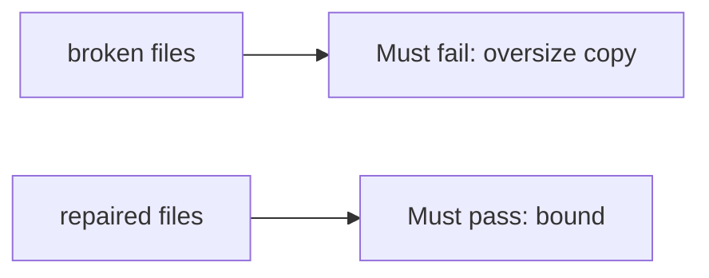

# The broken files must fail the oversize copy

**Kind:** verification-lab
**Loop step:** 5 Verify

## Check it

Writing the copy in Kotlin does not bound the buffer. A sanitizer flag is a product. `len(copy_into(4, b"abcdefgh", 4))` has to be `<= 4`, and a short honest copy may fit. Broken: the oversize copy is length 8. Repair keeps the copy at length 4 or less. Do not compile native exploits.

## Picture: broken must fail the oversize copy

A grep for `Kotlin` in a README can still hide that `copy_into(4, b"abcdefgh", 4)` still returns 8 bytes.



| Mode | Must show for this topic |
|---|---|
| Wrong input / abuse | `copy_into(4, b"abcdefgh", 4)` length <= 4; broken files must fail |
| Normal | Short declared length may copy (may pass on both) |
| Not claimed | A C walkthrough; an awareness-list dashboard; this page as a check-in; integer wrap |

The checks are in `labs/E4/e4-lab/tests/test_property.py`. `test_copy_does_not_exceed_buffer` is there so `declared_len` plus 8 still fails.

```text
python3 -m pytest labs/E4/e4-lab/tests --impl vulnerable
python3 -m pytest labs/E4/e4-lab/tests --impl fixed
```

A short copy that fits the buffer may stay allowed. Deny a copy that overruns it. If the broken files do not fail `test_copy_does_not_exceed_buffer`, the lab is miswired — fix the wiring, not the check. A setup error is not proof the rule holds.

## What the tests do not prove

- A C codec is bounded (native unpacker leftover, later and harder)
- Integer wrap of `n` is impossible
- Time bugs (use-after-free)
- A company language roadmap is complete
- This page as a finished check-in

## Practice

Call `copy_into(4, b"abcdefgh", 4)`. A `Kotlin` mention in a README is the language, not the bound.

## Use it somewhere new

Calling the language memory-safe is the slogan, not `copy_into` bounded. Do not use a third-party binary.

## What this page is not doing

Do not treat a native overflow as a prize. Do not log file bytes. Answer keys are not on this site. This page does not finish a check-in.
