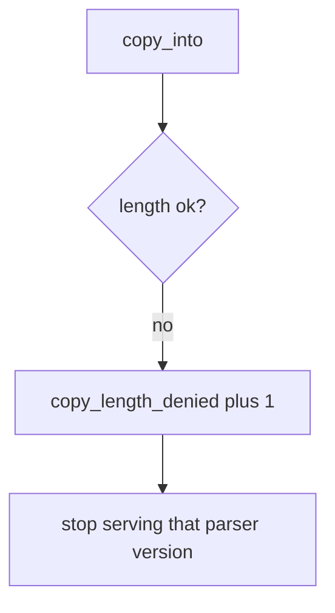

# E4-LO-06 — Detect copy_length_denied without logging file bytes

**Kind:** operations-exercise
**Loop step:** 6 Operate
**Standards:** NIST CSF 2.0 (final) DE/RS/RC as outcome labels; ASVS `v5.0.0-5.3.1`.

## Prevention is not absolute

A new unpacker can land after the min was "set once." Pair detect and recover. Do not log payload bytes (3.1 / 8.5). Uploaded bytes can contain secrets. Do not paste image bytes into the ticket.

## Mental model: rejected unpack is a signal



| Outcome | This module |
|---|---|
| Detect | `copy_length_denied` |
| Signal | declared_len, bufsize, src_len; never payload |
| Recover | Quarantine blobs; patch parser; do not ship overflowed binary |
| Residual | FFI; integer wrap; existing C codecs |

CSF 2.0 Detect / Respond / Recover name outcomes. They do not prove `v5.0.0-5.3.1`. A language-name sticker is not the property. Re-run `test_copy_does_not_exceed_buffer` after any unpacker change; a green “we use Kotlin” tile is not that pytest. JNI / protobuf C extensions are the same family — inventory them before claiming Recover.

## Framework defaults versus the operate guarantee

An ASAN dashboard will show sanitizer hits in CI languages that run under it and stay silent when a Python stand-in (or a C wheel) copies by declared_len. Detection must observe **length ≤ bufsize**, not “the language is memory-safe.” If the alert includes file bytes or a hex dump, you have opened a 3.1 cell.

## Practice

Write one log line you would accept. Tie it to `labs/E4/e4-lab`.

```text
log_denied reason=copy_length_denied declared_len=4 bufsize=4 src_len=8
```

Reject any line that includes file bytes, a hex dump, or "Gate 7 complete."

## Transfer

Clinic: deny the oversize DICOM copy; do not paste the image bytes into the ticket. Do not fuzz a third-party codec.

## Usability

An operator reject-UI must state *copy exceeds destination* without requiring a hex dump (WCAG 2.2 Success Criterion 4.1.3).

Cause vs impact stays split here too: the **cause** is declared length trusted over destination size; the **impact** is an oversize destination object; **prevention** is the three-way min; **detection** is `copy_length_denied`; **recovery** is quarantine-and-patch. Mechanism limit: this alert does not bound a leftover C codec and does not catch integer wrap.

## Non-goals

A language-name sticker is not the property. M2 stays not-attempted. CWE-119 is not this alert.
