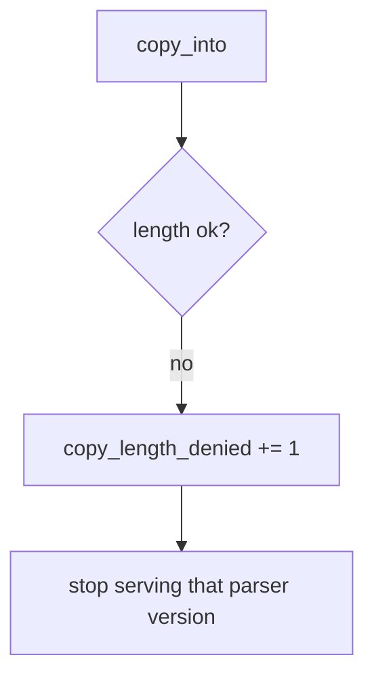

# E4-LO-06 — Detect copy_length_denied without logging file bytes

**Kind:** operations-exercise
**Loop step:** 6 Operate
**Standards:** NIST CSF 2.0 (final) DE/RS/RC as outcome labels; ASVS `v5.0.0-5.3.1`.

## Prevention is not absolute

A new unpacker can land after the min was "set once." Pair detect and recover. Do not log payload bytes (3.1 / 8.5). Uploaded bytes can contain secrets.

## Mental model: rejected unpack is a signal



| Outcome | This module |
|---|---|
| Detect | `copy_length_denied` |
| Signal | declared_len, bufsize, src_len; never payload |
| Recover | Quarantine blobs; patch parser; do not ship overflowed binary |
| Residual | FFI; integer wrap; existing C codecs |

## Practice

Write one log line you would accept. Tie it to `labs/E4/e4-lab`.

```
log_denied reason=copy_length_denied declared_len=4 bufsize=4 src_len=8
```

Reject any line that includes file bytes, a hex dump, or "Gate 7 complete."

## Transfer

Clinic: deny the oversize DICOM copy; do not paste the image bytes into the ticket.

## Non-goals

A language-name sticker is not the property. M2 stays not-attempted.
