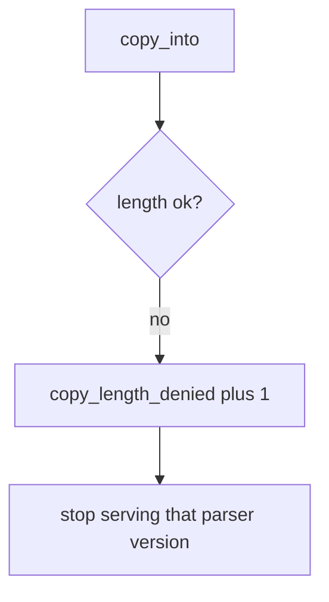

# Log the oversize copy, not the file bytes

**Kind:** operations-exercise
**Loop step:** 6 Operate

## Fixing it once is not enough

A new unpacker can land without the length bound. Keep file bytes and uploaded image bytes out of the ticket — they can hold secrets.

## Picture: a rejected unpack is a signal



A broken copy must not put file bytes in the log.

| Outcome | This topic |
|---|---|
| Notice | `copy_length_denied` |
| What the line holds | declared_len, bufsize, src_len; never file bytes |
| Recover | Quarantine blobs; patch the parser; do not ship an overflowed binary |
| Leftover | Helpers that call C; integer wrap; existing C codecs |

A language-name sticker does not prove this length rule. An oversized `declared_len` still has to fail `test_copy_does_not_exceed_buffer`. “We use Kotlin” does not cap the copy. JNI / protobuf C extensions still copy past the buffer; the unpacker is not safe until those copies are named.

## What the framework does vs what you still have to check

A sanitizer dashboard will show hits in languages that run under it and stay silent when a Python stand-in (or a C wheel) copies by `declared_len`. Notice must observe **length ≤ bufsize**, not “the language is memory-safe.” If the alert includes file bytes or a hex dump, you have opened a leak.

An operator reject screen must say *copy exceeds destination* without requiring a hex dump. People should be able to read that error without a dump of the file.

Look at declared length trusted over destination size first. An oversize destination object is the fallout. The three-way min is what to ship. `copy_length_denied` tells you it happened. Recover by quarantine-and-patch. It does not bound a leftover C codec and does not catch integer wrap.

## Practice

```text
log_denied reason=copy_length_denied declared_len=4 bufsize=4 src_len=8
```

Reject any line that includes file bytes, a hex dump, or “course gate complete.”

## Use it somewhere new

Deny the oversize DICOM copy; do not paste the image bytes into the ticket. Do not fuzz a third-party codec.

## What this page is not doing

“We use Kotlin” does not cap the copy. This page does not finish a check-in. An awareness-list name does not bound `declared_len`.
