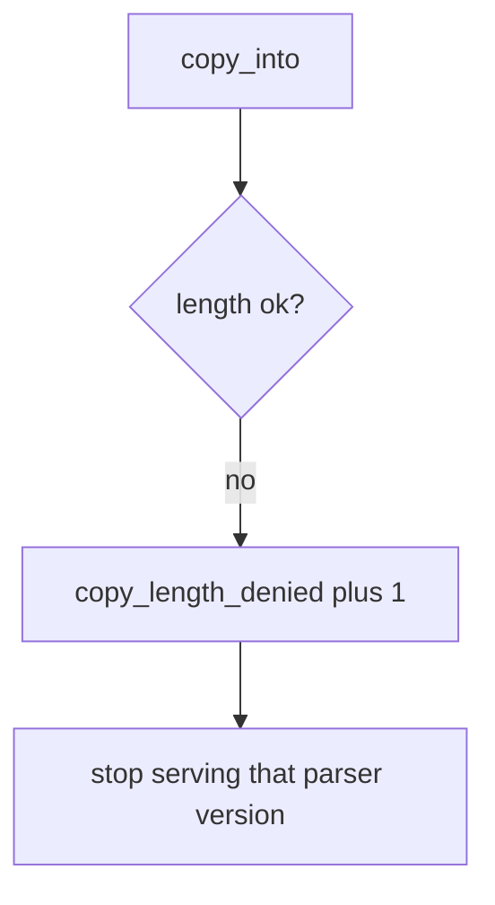

# Log the oversize copy, not the file bytes

**Kind:** operations-exercise
**Loop step:** 6 Operate

## Fixing it once is not enough

A new unpacker can land after the min was “set once.” Do not log file bytes. Uploaded bytes can contain secrets. Do not paste image bytes into the ticket.

## Picture: a rejected unpack is a signal



A broken copy is a notice-and-recover problem, not a licence to dump file bytes into the log.

| Outcome | This topic |
|---|---|
| Notice | `copy_length_denied` |
| What the line holds | declared_len, bufsize, src_len; never file bytes |
| Recover | Quarantine blobs; patch the parser; do not ship an overflowed binary |
| Leftover | Helpers that call C; integer wrap; existing C codecs |

A language-name sticker does not prove this length rule. Re-run `test_copy_does_not_exceed_buffer` after any unpacker change; a green “we use Kotlin” tile is not that check. JNI / protobuf C extensions are the same family — inventory them before claiming recover.

## What the framework does vs what you still have to check

A sanitizer dashboard will show hits in languages that run under it and stay silent when a Python stand-in (or a C wheel) copies by `declared_len`. Notice must observe **length ≤ bufsize**, not “the language is memory-safe.” If the alert includes file bytes or a hex dump, you have opened a leak.

An operator reject screen must say *copy exceeds destination* without requiring a hex dump. People should be able to read that error without a dump of the file.

Why it happens vs what it costs stays split here too: the **cause** is declared length trusted over destination size; the **cost** is an oversize destination object; **how you stop it** is the three-way min; **how you notice** is `copy_length_denied`; **how you recover** is quarantine-and-patch. What this alert cannot do: it does not bound a leftover C codec and does not catch integer wrap.

## Practice

For `labs/E4/e4-lab`, write a log line you would accept.

```text
log_denied reason=copy_length_denied declared_len=4 bufsize=4 src_len=8
```

Reject any line that includes file bytes, a hex dump, or “course gate complete.”

## Use it somewhere new

A clinic example: deny the oversize DICOM copy; do not paste the image bytes into the ticket. Do not fuzz a third-party codec.

## What this page is not doing

A language-name sticker is not the rule. This page does not finish a check-in. An awareness-list name is not this alert.
