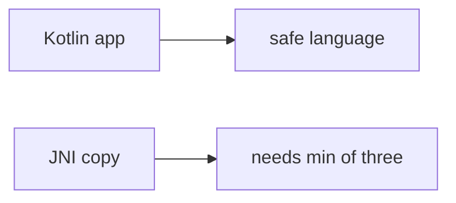

# E4-LO-07 — Transfer: clinic DICOM parser

**Kind:** transfer-challenge
**Loop step:** 7 Transfer
**Standards:** CISA memory-safe roadmaps (guidance). ASVS `v5.0.0-5.3.1`. CWE-119 awareness after the cause. `v5.0.0-5.3.3` Level 3 **advanced**.

## Change the workplace; keep length as mediation

Do not answer with a Top 25 / CWE / scanner as the definition of security. The SecureCollab sentence was: `len(copy_into(4, b"abcdefgh", 4))` must be ≤ 4. Rewrite it for a clinic without changing the fork.

**Prompt:** Clinic DICOM / image parser. Also name a protobuf C extension.

**Product sketch:** EHR-lite "the app is mostly Kotlin so copies are safe," plus "we mapped CWE-119 so the unpacker is done."

Rewrite the SecureCollab sentence. Include:

1. attacker capabilities (hostile header length — not a live clinic binary attack);
2. trust assumptions (three-way min at the **native** copy is TCB; Kotlin/CISA/CWE are not);
3. forbidden outcome (`copy_into` length > bufsize, not "HIPAA");
4. a test idea on a **local** fixture only (no third-party codec fuzzing);
5. residual (FFI, integer wrap, `v5.0.0-5.3.3` Level 3);
6. WCAG if operator reject-UI exists (operators must read the error without a hex dump).

## Mental model: Kotlin app vs C codec

If the app is “mostly Kotlin” while `copy_into` trusts declared_len plus slack, the cell is gone. A CISA roadmap and a CWE-119 mapping do not put `min(bufsize, declared_len, len(src))` next to the copy. A protobuf C extension is the same FFI grain — name it, do not fuzz a third-party binary here. CWE-119 is a regression label *after* the length cause, not the syllabus. `v5.0.0-5.3.3` is Level 3 advanced: native unpacker residual, not this pytest.

The clinic rewrite still has to keep the SecureCollab fork: oversize copy denied, short honest copy may fit. Adding a Kotlin rewrite without a destination bound leaves length > 4. The local pytest analogue is `test_copy_does_not_exceed_buffer` — on a fixture, not a live codec.

## What graders reject

| Reject | Why |
|---|---|
| "we use Kotlin / Rust" | Not mediation of this copy |
| Native overflow PoC / public binary | Lab policy |
| "CWE-119 so 1.2 is done" | Awareness after the cause |
| "ASAN in CI" | Sanitizer, not this predicate |
| "Gate 7 complete" | Forbidden stamp |

## Practice

One page. No keys. `labs/E4/e4-lab` is the only running system you may break. Do not compile a native overflow.

## Non-goals

Weaponized overflow walkthroughs. Third-party binary fuzzing. Claiming Gate 7 or M2 from this page.
