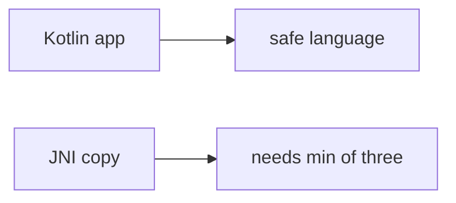

# E4-LO-07 — Transfer: clinic DICOM parser

**Kind:** transfer-challenge
**Loop step:** 7 Transfer
**Standards:** CISA memory-safe roadmaps (guidance). ASVS `v5.0.0-5.3.1`. CWE-119 awareness after the cause.

## Change the workplace; keep length as mediation

Do not answer with a Top 25 / CWE / scanner as the definition of security.

**Prompt:** Clinic DICOM / image parser. Also name a protobuf C extension.

**Product sketch:** EHR-lite "the app is mostly Kotlin so copies are safe," plus "we mapped CWE-119 so the unpacker is done."

Rewrite the SecureCollab sentence. Include:

1. attacker capabilities (hostile header length — not a live clinic binary attack);
2. trust assumptions (three-way min at the **native** copy is TCB; Kotlin/CISA/CWE are not);
3. forbidden outcome (`copy_into` length > bufsize, not "HIPAA");
4. a test idea on a **local** fixture only (no third-party codec fuzzing);
5. residual (FFI, integer wrap, `v5.0.0-5.3.3` Level 3);
6. WCAG if operator reject-UI exists (operators must read the error without a hex dump).

## Mental model: Kotlin app vs C codec

## What graders reject

| Reject | Why |
|---|---|
| "we use Kotlin / Rust" | Not mediation of this copy |
| Native overflow PoC / public binary | Lab policy |
| "CWE-119 so 1.2 is done" | Awareness after the cause |

## Practice

One page. No keys. `labs/E4/e4-lab` is the only running system you may break.
