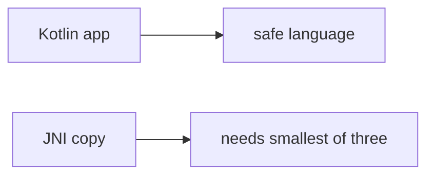

# Same idea on a clinic DICOM parser

**Kind:** transfer-challenge
**Loop step:** 7 Transfer

## Use it somewhere new

You get a **clinic DICOM / image parser**. On the notes app, `len(copy_into(4, b"abcdefgh", 4))` must be ≤ 4.

**Prompt:** Clinic DICOM / image parser. Also name a protobuf C extension.

**Product sketch:** EHR-lite “the app is mostly Kotlin so copies are safe,” plus “we mapped an awareness-list name so the unpacker is done.”

1. who can act (hostile header length — not a live clinic binary attack);
2. what you trust (smallest of three at the **native** copy is what you trust; Kotlin / a company roadmap / an awareness-list name are not);
3. what must not happen (`copy_into` length > bufsize, not a privacy-law name);
4. a test idea on a **local** practice only (no third-party codec fuzzing);
5. leftover (helpers that call C, integer wrap, native unpacker leftover later and harder);
6. whether a human “copy rejected” path must meet the web accessibility baseline (operators must read the error without a hex dump).

## Picture: Kotlin app vs C codec

Renaming “notes unpacker” to “DICOM parser” is not transfer. If the app is “mostly Kotlin” while `copy_into` trusts `declared_len` plus 8, the rule is gone. A company language roadmap and an awareness-list mapping do not put `min(bufsize, declared_len, len(src))` next to the copy. A protobuf C extension is the same grain — name it, do not fuzz a third-party binary here. An awareness-list name is a regression label *after* the length cause, not the syllabus. Native unpacker leftover is later and harder: not this check.

An oversize copy still has to be denied. A short honest copy may still fit. Adding a Kotlin rewrite without a destination bound leaves length > 4. The local check is `test_copy_does_not_exceed_buffer` — on a practice, not a live codec.

Checking every path still means the native copy itself is bounded. A language sticker without that check leaves the length rule broken.

## What is not good enough

| Reject | Why |
|---|---|
| “we use Kotlin / Rust” | Not checking this copy |
| Native overflow walkthrough / public binary | Course rules |
| “awareness-list name so this rule is done” | Awareness after the cause |
| “sanitizer in CI” | Tool, not this check |
| “course gate complete” | Forbidden stamp |

## Practice

One page. No keys. `labs/E4/e4-lab` is the only running system you may break. Do not compile a native overflow.

## What this page is not doing

Weaponized overflow walkthroughs. Third-party binary fuzzing. This page does not finish a check-in.
