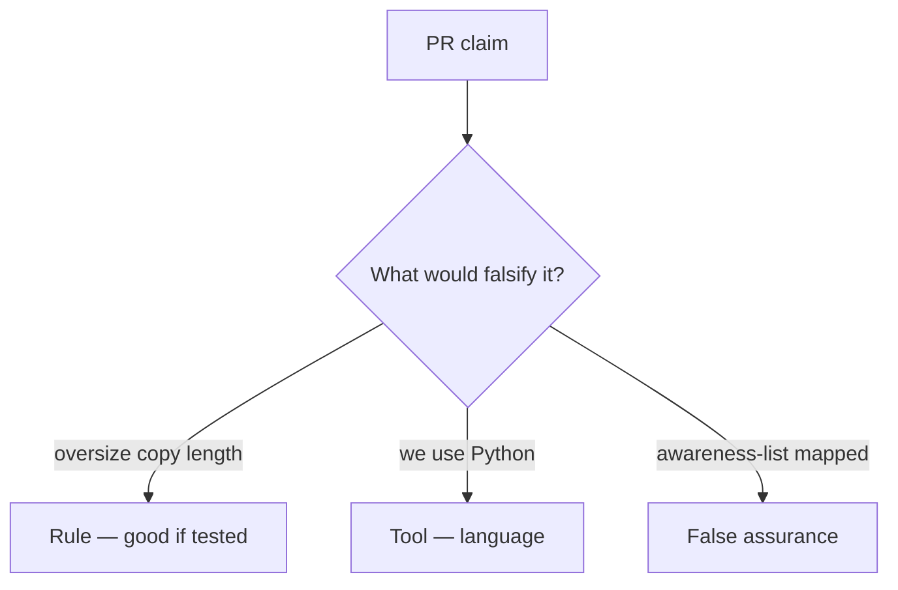

# Would you merge this declared_len-plus-8?

**Kind:** code-review
**Loop step:** Review

## What you are reviewing

Read `labs/E4/e4-lab/vulnerable/` as the unpacker. Does `copy_into(4, b"abcdefgh", 4)` still return more than 4 bytes?

A sticky note “will bound later” is not `test_copy_does_not_exceed_buffer` going green.

## Picture: copy returns full src / declared_len plus 8

**Copy returns full src / declared_len plus 8**.

Length still has to be ≤ bufsize. If the change never uses the three-way min, that oversize path is still open. A language sticker without that check is still the same problem.

Helpers that call C are leftover. Integer wrap is leftover. This page does not finish a check-in. Do not compile a native overflow to prove the finding.

Checking every path here means every copy site, including ones that look “safe” because the rest of the app is Kotlin.

## Problems to find (name them yourself)

- Copy returns full src / declared_len plus 8
- No destination length check
- Unsafe call into C treated as bounded because the app is Kotlin
- “Python so we are memory safe” with a C wheel

Also reject: native exploit walkthroughs; shipping without re-running `test_copy_does_not_exceed_buffer`; keys in lessons; treating this buffer lesson as a check-in; treating an awareness list as the syllabus.

## Common mix-ups

- Python slice is what C does
- A memory-safe language removes risk from calling C
- An awareness list is the syllabus
- A sanitizer is `copy_into`
- A company language roadmap is this check

## Use it somewhere new

A Kotlin rewrite and an awareness-list mapping, without a destination bound, do not finish the copy gate. A Kotlin rewrite is not a destination bound — write the bufsize bound.

## What this page is not doing

Until `test_copy_does_not_exceed_buffer` passes, “will bound later” is unfinished work. Do not fuzz a public binary to prove the finding.
