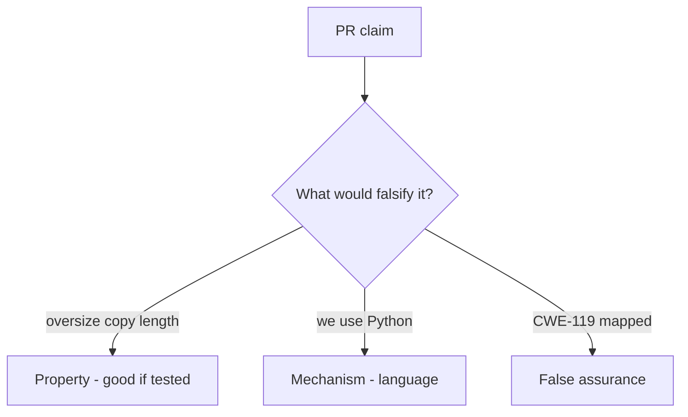

# E4-LO-08 — Review declared_len-plus-8 as a PR

**Kind:** code-review
**Loop step:** Review
**Standards:** ASVS `v5.0.0-5.3.1`. CISA roadmaps as guidance.

## Review the fixture as if it were SecureCollab’s unpacker

Review `labs/E4/e4-lab/vulnerable/` as a SecureCollab PR. Intended findings live only in `content/assessment/keys/E4.md` — not here.

## Mental model: property, mechanism, or false assurance

Seeded smells (label them yourself; do not open the keys file):

- Copy returns full src / declared_len plus slack
- No destination length check
- Unsafe FFI treated as bounded because the app is Kotlin
- "Python so we are memory safe" with a C wheel

Also reject: native exploit walkthroughs, keys in lessons, claiming Gate 7.

## Misconceptions

- Python slice is what C does
- A memory-safe language removes FFI risk
- CWE Top 25 is the syllabus

## Practice

Write three review notes. Tie at least one to `test_copy_does_not_exceed_buffer`.

## Transfer

Clinic PR that "added a Kotlin rewrite and CWE-119 mapping" without a destination bound is incomplete.
