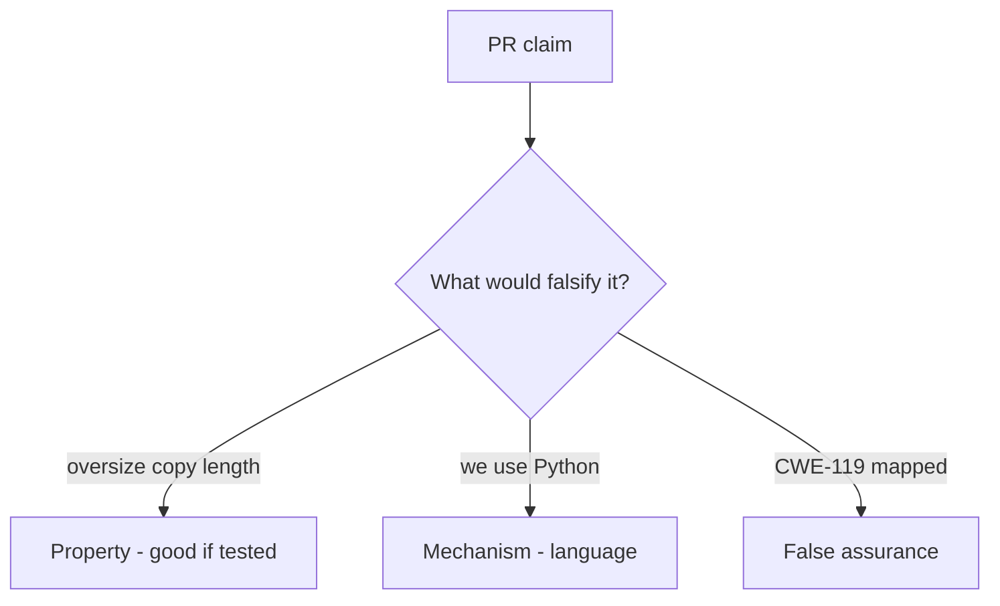

# E4-LO-08 — Review declared_len-plus-8 as a PR

**Kind:** code-review
**Loop step:** Review
**Standards:** ASVS `v5.0.0-5.3.1`. CISA roadmaps as guidance. CWE-119 awareness after the cause.

## Review the fixture as if it were SecureCollab’s unpacker

Review `labs/E4/e4-lab/vulnerable/` as a SecureCollab PR. Your job is not to count suspicious lines. Reconstruct whether `copy_into(4, b"abcdefgh", 4)` still returns more than 4 bytes, compare that with the module invariant, and write changes a developer can verify.

Intended findings live only in `content/assessment/keys/E4.md` — not here. Do not open the keys file until your review has been evaluated.

## Mental model: Copy returns full src / declared_len plus slack

Start with this seeded smell: **Copy returns full src / declared_len plus slack**. Label it property, mechanism, or false assurance before you accept the PR.

Classification starts at the protected effect (length ≤ bufsize). Everything that is not the three-way min at that call is a candidate oversize path. A language sticker without that pytest is the same smell, not a different finding class.

FFI is residual. Integer wrap is residual. Do not skip `test_copy_does_not_exceed_buffer`. Do not claim Gate 7. Do not compile a native overflow to prove the finding.

## Seeded smells (label them yourself)

- Copy returns full src / declared_len plus slack
- No destination length check
- Unsafe FFI treated as bounded because the app is Kotlin
- "Python so we are memory safe" with a C wheel

Also reject: native exploit walkthroughs; shipping without re-running `test_copy_does_not_exceed_buffer`; keys in lessons; claiming Gate 7; treating CWE Top 25 as the syllabus.

## Misconceptions this module refuses

- Python slice is what C does
- A memory-safe language removes FFI risk
- CWE Top 25 is the syllabus
- ASAN is `copy_into`
- CISA roadmap is this pytest

## Practice

Write three review notes a maintainer could act on. Each note: observation, property or false assurance, suggested structural change, residual you will **not** delete. Tie at least one to `test_copy_does_not_exceed_buffer`.

## Transfer

Clinic PR that "added a Kotlin rewrite and CWE-119 mapping" without a destination bound is an incomplete copy-gate review. Name the independent falsehood that would still keep length ≤ bufsize.

## Non-goals

Do not merge by adding a comment “will bound later.” That comment is a residual without an owner. Do not fuzz a public binary to prove the finding.
