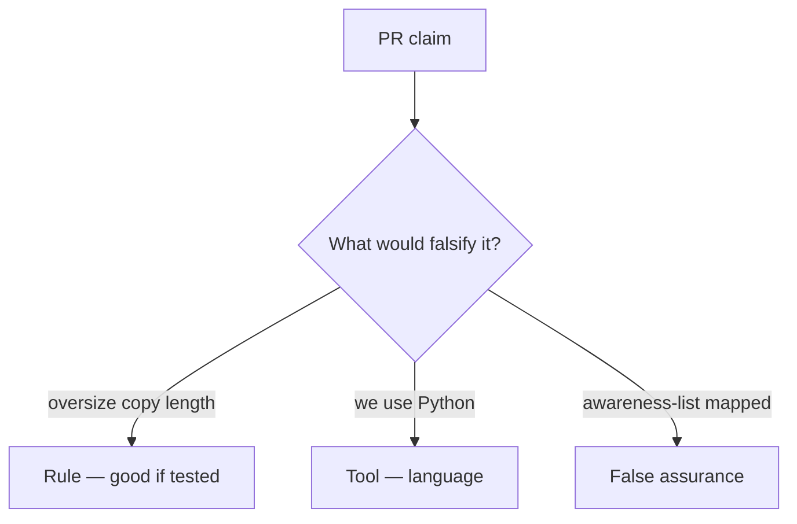

# Would you merge this declared_len-plus-8?

**Kind:** code-review
**Loop step:** Review

The answers are not on this page. Do not open the keys file until someone has looked at your review.

## What you are reviewing

Review `labs/E4/e4-lab/vulnerable/` as a change to the notes app’s unpacker. Check whether `copy_into(4, b"abcdefgh", 4)` still returns more than 4 bytes, compare that with the rule, and write changes a developer can verify.

The check you already ran (`test_copy_does_not_exceed_buffer`) is the rule test. A comment “will bound later” is not.

## Picture: copy returns full src / declared_len plus 8

**Copy returns full src / declared_len plus 8**. Label it rule, tool, or false assurance before you accept the change.

Length still has to be ≤ bufsize. If the change never uses the three-way min, that oversize path is still open. A language sticker without that check is still the same problem.

Helpers that call C are leftover. Integer wrap is leftover. Do not skip `test_copy_does_not_exceed_buffer`. Do not claim a course gate. Do not compile a native overflow to prove the finding.

Checking every path here means every copy site, including ones that look “safe” because the rest of the app is Kotlin.

## Problems to find (name them yourself)

- Copy returns full src / declared_len plus 8
- No destination length check
- Unsafe call into C treated as bounded because the app is Kotlin
- “Python so we are memory safe” with a C wheel

Also reject: native exploit walkthroughs; shipping without re-running `test_copy_does_not_exceed_buffer`; keys in lessons; claiming a course gate; treating an awareness list as the syllabus.

## Common mix-ups

- Python slice is what C does
- A memory-safe language removes risk from calling C
- An awareness list is the syllabus
- A sanitizer is `copy_into`
- A company language roadmap is this check

## Practice

Write three review notes a maintainer could act on. Each note: what you saw, rule or false assurance, suggested structural change, leftover you will **not** delete. Tie at least one to `test_copy_does_not_exceed_buffer`. Do not open the keys file.

## Use it somewhere new

Clinic change that “added a Kotlin rewrite and an awareness-list mapping” without a destination bound is an incomplete copy-gate review. Name the independent falsehood that would still keep length ≤ bufsize.

## What this page is not doing

Do not merge by adding a comment “will bound later.” That comment is leftover risk without an owner. Do not fuzz a public binary to prove the finding.
