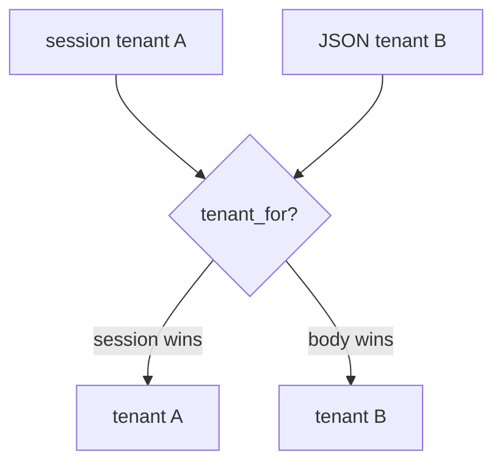
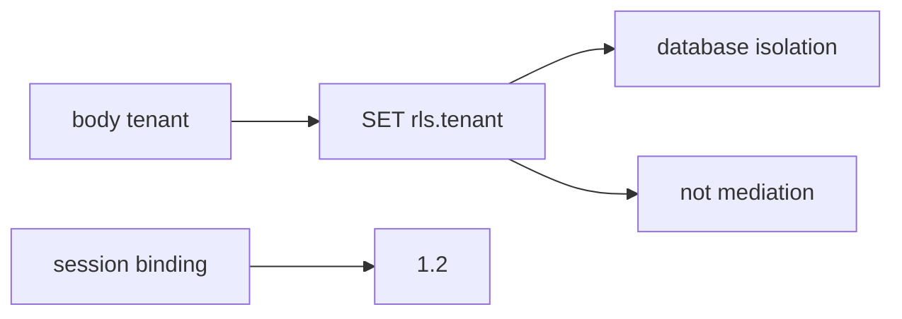

# E5-LO-01 — The JSON body is not the tenant

**Kind:** concept-model
**Loop step:** 1 Property
**Standards:** ASVS 5.0.0 (final) `v5.0.0-8.2.1`, `v5.0.0-8.2.2`; `v5.0.0-8.3.2` is **Level 3, advanced**. `v5.0.0-15.3.3` mass assignment of the tenant field (related). API Top 10 2023 API1 is **awareness after** the cause.

## The claim this module owns

SecureCollab notes live in a workspace. **Authorization of the tenant context** is whether the *session binding* names the workspace. A JSON or GraphQL `tenant` / `org_id` field is untrusted input (7.1), not a grant (1.2 / 4.4).

> `tenant_for({"tenant": "A"}, {"tenant": "B"})` must be `A`. Matching A/A may keep A.

The forbidden outcome is **JSON body switches the bound tenant**. At SaaS scale that is cross-tenant read/write through every copy.

ASVS `v5.0.0-8.2.1` / `v5.0.0-8.2.2` want isolation of the object and tenant. `v5.0.0-15.3.3` wants unused/writable fields not to become policy. `v5.0.0-8.3.2` (immediate grant change) is **Level 3, advanced**. Postgres RLS and ReBAC/Zanzibar products are **layers**, not this sentence.

## Mental model: body vs session



## Mental model: RLS from the body is the same bug



**Mechanism (not the property):** subdomain Host header, JWT `org` claim copied from the client, a Zanzibar dashboard, API1 mapped.

## Root cause vs impact vs prevention vs detection vs recovery

| Slice | For this property |
|---|---|
| Root cause | Client-chosen tenant treated as binding |
| Preconditions | `tenant_for({A},{B}) == B` |
| Trigger | Member of A sends tenant B in JSON/GraphQL |
| Impact | Authorization of tenant context — cross-tenant read/write |
| Prevention | Ignore body tenant; bind from session; RLS extra *after* that |
| Detection | `body_tenant_mismatch` |
| Recovery | Audit B for A's actions; revoke the confused session |

## Framework defaults versus the tenant guarantee

Postgres RLS will isolate whatever GUC you set. If you set it from the body, RLS enforces the **attacker's** tenant.

## Mechanism limits

- Search, cache (2.2), and analytics copies (5.1 / `v5.0.0-14.2.3`) still need the bound tenant in the key.
- Support impersonation without audit (E6).
- Honest super-admin (3.3).
- ReBAC tuples are another map, not this lab.

## Usability and accessibility

Tenant-switcher UI for support must be keyboard-operable and must not look like the user's own workspace (WCAG 2.2). A silent impersonation is both a 1.2 and a 1.4 failure.

## Practice

List every place tenant is read from. Then run:

```
python3 -m pytest labs/E5/e5-lab/tests --impl vulnerable
python3 -m pytest labs/E5/e5-lab/tests --impl fixed
```

The first command must fail. The second must pass.

## Transfer

Clinic group practice switching `org_id` in JSON. Zanzibar tuple vs this binding.

## Residual risk

Copies; silent impersonation; honest super-admin. `v5.0.0-8.3.2` Level 3 grant-change residual.

## Non-goals

Live SaaS tenants. API Top 10 as the syllabus. Gate 7 / M2.
