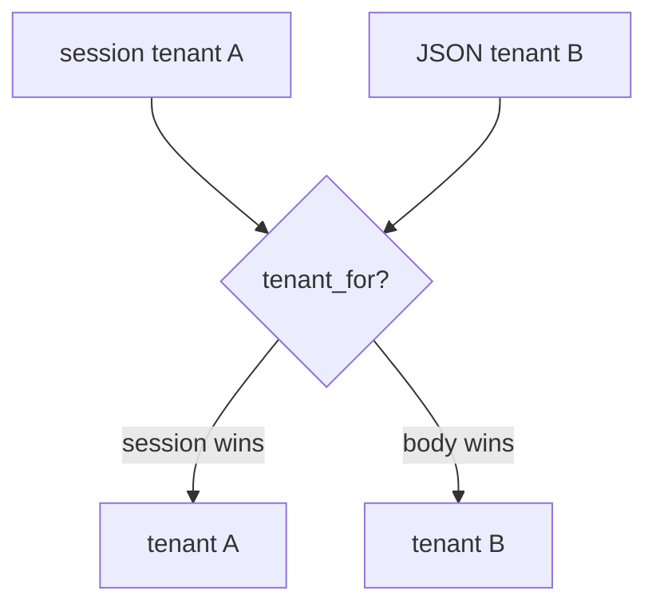
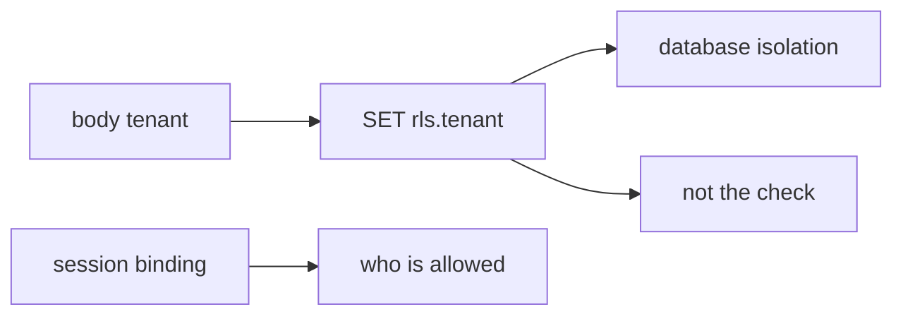

# The JSON body is not the company

**Kind:** concept-model
**Loop step:** 1 Property

## The rule

The notes app stores notes per company. A signed-in session already names which company you are in. **Who is allowed for that company context** is whether the *session binding* names the company. A JSON or GraphQL `tenant` / `org_id` field is untrusted input, the same class as an extra writable field. It is not a grant. The JSON body is not the tenant.

> `tenant_for({"tenant": "A"}, {"tenant": "B"})` must be `A`. Matching A/A may keep A.

What must not happen is **the JSON body switches the bound company**. At product scale that is a read or write into another company through every copy — search, cache, and analytics included.

Isolation of the object and the company. They also want unused or writable fields not to become policy. Extra rows about applying grant changes immediately are advanced — not this check. Famous “broken object” lists are a later awareness check after this binding exists. They are not the syllabus. PostgreSQL row-level rules and a relationship-graph product are **layers**, not the session tenant.

## Picture: body vs session



## Picture: a row-level rule from the body is the same bug



A subdomain Host header, a JWT `org` claim copied from the client, and a relationship-graph dashboard do not bind the company from the session. A famous-bugs mapping is a label after the fact.

## Why it happens, what it costs, how you stop it, how you notice, how you recover

| Slice | For this rule |
|---|---|
| Why it happens | Client-chosen company treated as binding |
| What's already wrong | `tenant_for({A},{B}) == B` |
| Trigger | Member of A sends tenant B in JSON or GraphQL |
| What it costs | Who is allowed for company context — read or write into another company |
| How you stop it | Ignore the body company; bind from the session; row-level rules extra *after* that |
| How you notice | `body_tenant_mismatch` |
| How you recover | Audit B for A's actions; take back the confused session |

## What the framework does vs what you still have to check

PostgreSQL row-level rules will isolate whatever session variable you set. If you set it from the body, the database enforces the **attacker's** company.

`tenant_for`, session A plus body B is A — files in `labs/E5/e5-lab`. It is local only. It is not a live company.

## What the tool cannot do

- Search, cache, and analytics copies still need the bound company in the key.
- Support impersonation without an audit trail is a later topic.
- An honest super-admin is leftover, later.
- Relationship-graph tuples are another map, not this practice.

## Can people still use it

A support company-switcher must be usable from the keyboard and must not look like the user’s own company. A silent impersonation is both a who-is-allowed failure and an accessibility failure.

## Practice

List every place the company is read from. Then run:

```text
python3 -m pytest labs/E5/e5-lab/tests --impl vulnerable
python3 -m pytest labs/E5/e5-lab/tests --impl fixed
```

## Use it somewhere new

Sketch a group practice switching `org_id` in JSON. Compare a relationship-graph tuple to this binding.

## What this page is not doing

Do not use live companies. Do not treat a famous-bugs list as the syllabus. This site does not mark you as finished. Answer keys are not on this site.
