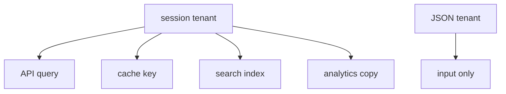
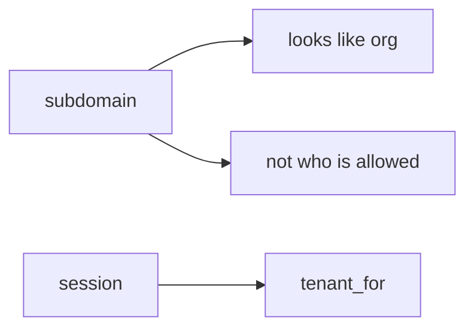

# Session binding vs body vs copies

**Kind:** design-exercise
**Loop step:** 2 Model

## Could someone else name the company check from your scale map?

“We have row-level rules” does not name **session binding, body fields, where the database session variable comes from, cache/search/lake keys, and impersonation**.

`tenant_for(session, body)` — no public company. The notes app binds company from the session. The JSON body is not the tenant.

## Picture: one binding, many copies

## Picture: Host header is not the company

## Step 1: name the pieces

| Piece | This system |
|---|---|
| People | member of A; support impersonator |
| Objects | notes; search docs; cache entries |
| Actions | `tenant_for`; query; index |
| Paths | JSON or GraphQL body; Host; JWT |
| What you trust | session binding |
| What you do not trust | body tenant; Host; client JWT org |
| Time | binding at request; copies after write |
| The rule | who is allowed for company context |

## Step 2: write cells

| Person | Object | Action | Decision |
|---|---|---|---|
| member A | tenant B | set from body | deny |
| session A | notes A | query | allow |
| row-level session var | tenant | SET from body | deny |
| cache | key | omit tenant | deny |

## Practice

Look at `rls.py` under `labs/E5/e5-lab`.

## Use it somewhere new

`org_id` in a bulk GraphQL mutation is the same grain: body tenant overrides session must stay false.

## What can still go wrong

Silent impersonation; lake jobs that re-key on a body field.

## What this page is not doing

Naming “broken tenancy” does not bind company from the session. Answer keys are not on this site.
