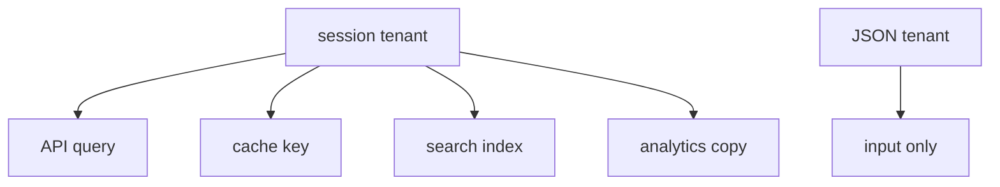
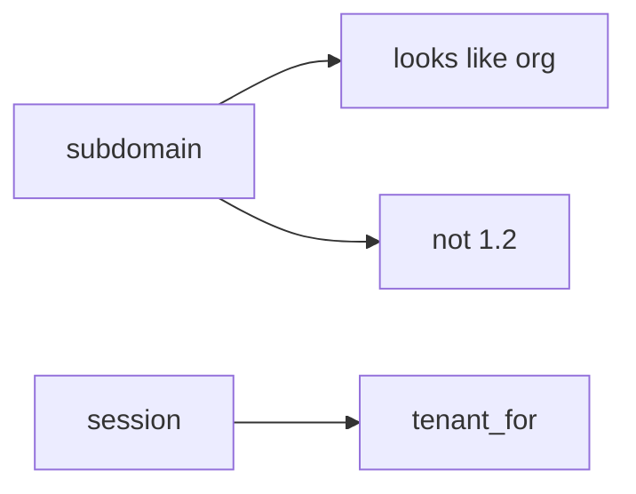

# E5-LO-02 — Session binding vs body vs copies

**Kind:** design-exercise
**Loop step:** 2 Model
**Standards:** ASVS `v5.0.0-8.2.1`, `v5.0.0-8.2.2`. `v5.0.0-14.2.3` for copies.

## Can a second engineer name the tenant check from your scale map?

"We have RLS" is not this lesson. A reviewable model names **session binding, body fields, RLS GUC source, cache/search/lake keys, and impersonation**.

SecureCollab freeze: local `tenant_for(session, body)`. No public tenant.

## Mental model: one binding, many copies

## Mental model: Host header is not the tenant

## Step 1: freeze pieces

| Piece | This system |
|---|---|
| Subjects | member of A; support impersonator |
| Objects | notes; search docs; cache entries |
| Actions | `tenant_for`; query; index |
| Channels | JSON/GraphQL body; Host; JWT |
| TCB | session binding |
| Untrusted | body tenant; Host; client JWT org |
| State / time | binding at request; copies after write |
| 1.1 cell | authorization of tenant context |

## Step 2: write cells

| Subject | Object | Action | Decision |
|---|---|---|---|
| member A | tenant B | set from body | deny |
| session A | notes A | query | allow |
| RLS GUC | tenant | SET from body | deny |
| cache | key | omit tenant | deny |

## Practice

Draw the map. Point at `labs/E5/e5-lab` file `rls.py`.

## Transfer

Clinic `org_id` in a bulk GraphQL mutation. Same grain.

## Residual risk

Silent impersonation; lake jobs that re-key on a body field.

## Non-goals

Top 10 as the definition of security. Keys stay out of lessons.
