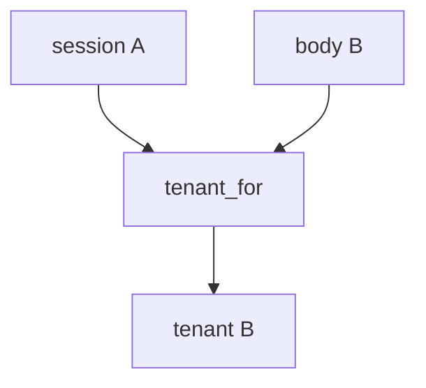

# E5-LO-03 — Observe body override, do not probe public tenants

**Kind:** mechanism-lab
**Loop step:** 3 Break
**Standards:** OWASP ASVS 5.0.0 (final) `v5.0.0-8.2.1`. `v5.0.0-8.3.2` grant-change cache is **Level 3, advanced**. `v5.0.0-15.3.3` mass assignment of the tenant field (related). API Top 10 2023 API1 is **awareness after** the cause. Lab policy: local only.

## Authorized scope

`labs/E5/e5-lab` only. The fixture is an in-process `tenant_for(session, body)`. Synthetic tenants A and B. Do **not** send `org_id` to a production SaaS, clinic tenant, or classmate preview as the exercise.

**Forbidden outcome:** JSON body switches the bound tenant. `tenant_for({"tenant": "A"}, {"tenant": "B"})` returns `"B"`.

Attacker capability in this lab: a member of A who can write a JSON (or GraphQL) field. That stands in for “Postgres RLS is on so tenants are done,” a Zanzibar dashboard treated as 1.2, or API1 mapped as this cell. Trust assumption: `tenant_for` is supposed to bind from the **session**. FastAPI body parsing, a Host header, and an RLS GUC set from JSON are not in the TCB for this cell.

## Mental model: body wins



`--impl vulnerable` prefers `body["tenant"]`. That is 7.1 mass assignment of the isolation key. Preconditions: body tenant overrides session. You do not need GraphQL. You must not probe a live tenant.

ASVS `v5.0.0-8.2.1` wants isolation of the object and tenant. Module 4.4 already said the object id is not the grant; this cell is **the tenant context is not a client field**. Gate 7 and M2 stay **not-attempted**. Electives open after Phase 7; they do not stamp it.

## What to read in the fixture

`vulnerable/rls.py` returns the body tenant when present. Tests:

- `test_body_cannot_switch_tenant`
- `test_matching_body_may_keep_session_tenant` — A/A may pass on both

You do not need a new tenant letter. The failure of `test_body_cannot_switch_tenant` *is* the evidence. Do not paste the fixture into a public API.

Do not open the fixed tree yet. Diagnose the cause first.

## Root cause vs impact vs prevention vs detection vs recovery

| Slice | This lab |
|---|---|
| Required property | `tenant_for({A},{B}) == A` |
| Root cause | Client-chosen tenant treated as binding |
| Preconditions | body tenant overrides session |
| Trigger | Member of A sends tenant B in JSON/GraphQL |
| Impact | Cross-tenant read/write through every copy |
| Prevention | Bind from session; ignore body for isolation |
| Detection | `body_tenant_mismatch`; never note bodies |
| Recovery | Audit B for A's actions; revoke the confused session |
| Not the lesson | API1; an RLS product; live SaaS; Gate 7 complete |

## Framework defaults versus the binding guarantee

FastAPI will bind whatever field you declare. Postgres RLS will isolate whatever GUC you `SET`. A subdomain Host header is client-controlled. The application guarantee is: **this** fixture, session A plus body B is A.

## Practice

```text
python3 -m pytest labs/E5/e5-lab/tests --impl vulnerable
```

Run from `labs/E5/e5-lab` if a repo-root collection picks up `site/`. Record `test_body_cannot_switch_tenant`. Do not probe public hosts. An environment error is not security evidence.

## Transfer

Clinic group practice: predict the switch without leaving this directory. Do not hit a live EHR.

## Non-goals

No live-SaaS, production-tenant, or public GraphQL instructions. Do not claim Gate 7. API1 stays awareness after the cause.
