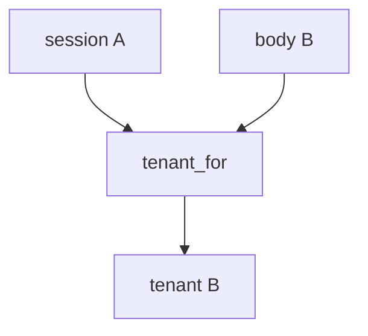

# E5-LO-03 — Observe body override, do not probe public tenants

**Kind:** mechanism-lab
**Loop step:** 3 Break
**Standards:** ASVS `v5.0.0-8.2.1`. Lab policy: local only.

## Authorized scope

`labs/E5/e5-lab` only. Synthetic tenants A and B. Do **not** send `org_id` to a production SaaS, clinic tenant, or classmate preview as the exercise.

**Forbidden outcome:** JSON body switches the bound tenant.

## Mental model: body wins



`--impl vulnerable` prefers `body["tenant"]`. That is 7.1 mass assignment of the isolation key.

## What to read in the fixture

`vulnerable/rls.py` returns the body tenant when present. Tests require `tenant_for({A},{B}) == A`. Do not paste the fixture into a public API.

## Root cause vs impact

| Slice | Lab |
|---|---|
| Root cause | Client-chosen tenant treated as binding |
| Impact | Cross-tenant read/write |
| Not the lesson | API1 or an RLS product as the definition |

## Practice

```
python3 -m pytest labs/E5/e5-lab/tests --impl vulnerable
```

Record `test_body_cannot_switch_tenant`. Do not probe public hosts.

## Transfer

Clinic group practice: predict the switch without leaving this directory.

## Non-goals

No live-SaaS, production-tenant, or public GraphQL instructions.
