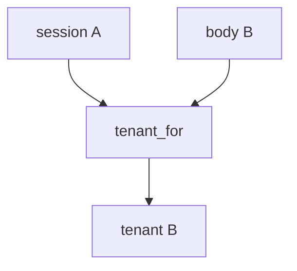

# Practice: body tenant overrides session

**Kind:** mechanism-lab
**Loop step:** 3 Break

## Try it

The practice is not a website you attack. `tenant_for(session, body)` prefers `body["tenant"]` when that key is present, so a body-chosen company already wins. You do not need a public product.

> The JSON body is not the tenant. `tenant_for({"tenant": "A"}, {"tenant": "B"})` must return `"A"`. If it returns `"B"`, body tenant overrides session.

## Where you may practice

Stay inside `labs/E5/e5-lab`. Fake companies A and B go through `tenant_for(session, body)`. It does not open a network. Do not send `org_id` to a live product, a clinic company, or a classmate preview.

What must not happen: the JSON body switches the bound company. `tenant_for({"tenant": "A"}, {"tenant": "B"})` returns `"B"`.

Picture a member of A who can write a JSON (or GraphQL) field — “row-level rules are on so companies are done,” a relationship-graph dashboard treated as who-is-allowed, or a famous-bugs mapping treated as this rule. `tenant_for` is supposed to bind the company from the session — not FastAPI body parsing, a Host header, or a row-level session variable set from JSON.

## Picture: body wins



The broken files (`--impl vulnerable`) prefer `body["tenant"]`. That is extra writable fields applied to the isolation key. Body tenant overrides session. You do not need GraphQL. You must not probe a live company.

Isolation of the object and the company. An earlier topic already said the object id is not the grant; this rule is **the company context is not a client field**. This site does not mark you as finished.

## What to look at: the cause, not a hunt

`vulnerable/rls.py` returns the body company when present. Tests:

- `test_body_cannot_switch_tenant`
- `test_matching_body_may_keep_session_tenant` — A/A may pass on both

Do not paste the practice files into a public API.

## Why it happens vs what it costs

| Slice | Practice |
|---|---|
| Required rule | `tenant_for({A},{B}) == A` |
| Why it happens | Client-chosen company treated as binding |
| What's already wrong | body tenant overrides session |
| Trigger | Member of A sends tenant B in JSON or GraphQL |
| What it costs | Read or write into another company through every copy |
| How you stop it later | Bind from the session; ignore the body for isolation |
| How you notice later | `body_tenant_mismatch`; never note bodies |
| How you recover later | Audit B for A's actions; take back the confused session |
| Out of scope | A famous-bugs name, a row-level product, a live company, this GraphQL lesson as a finished check-in |

FastAPI will bind whatever field you declare. PostgreSQL row-level rules will isolate whatever session variable you `SET`. A subdomain Host header is client-controlled. Session A plus body B is A.

## Practice

```text
python3 -m pytest labs/E5/e5-lab/tests --impl vulnerable
```

Run from `labs/E5/e5-lab` if a repo-root collection picks up `site/`. Do not probe public hosts. A setup error is not proof the rule holds.

## Use it somewhere new

A group practice can switch `org_id` in JSON. Predict the switch without leaving this directory. Do not hit a live clinic system.

## What this page is not doing

No live-product, production-company, or public GraphQL instructions. This page does not finish a check-in. Famous-bugs lists stay awareness after the cause.
