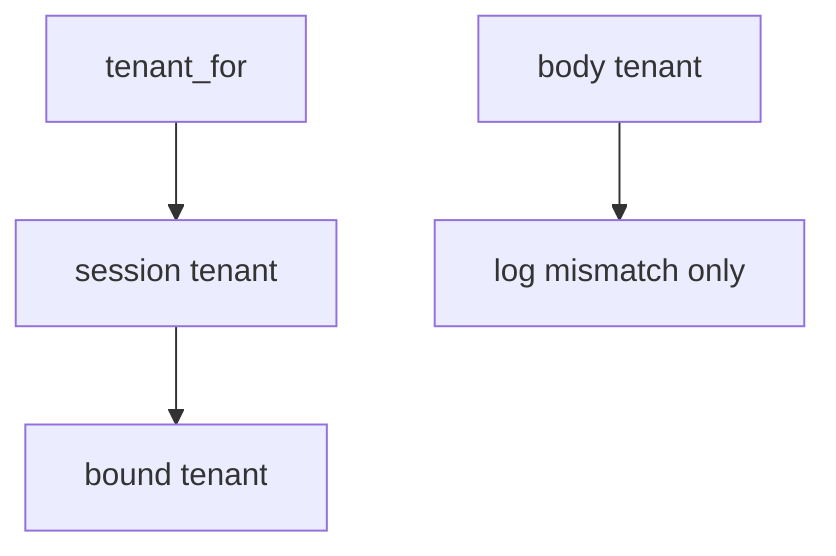

# Bind the company from the session

**Kind:** design-exercise
**Loop step:** 4 Build

## The rule

A denylist of yesterday’s company ids is not the fix. Hiding the company picker is not the fix. “Row-level rules are on” is not the fix. Trusting a mismatch because the body “looks honest” is not the fix.

The structural change is: `tenant_for` **returns `session["tenant"]`**. Structural means the runtime ignores the body field for isolation. Bind tenant from the session. Fail closed: a lying body cannot switch company. Row-level rules may *accompany* this binding; they must not be `SET` from the body. Structural means session win — not a subdomain, not a relationship-graph tuple, not a famous-bugs mapping.

The smallest restore for notes-app notes is: session A, body B → A. Do not fail open because “row-level rules are on.” Do not “repair” a mismatch by trusting the body. The JSON body is not the tenant.

## Picture: session gate



Do not accept “we enabled row-level rules” as membership in the session. Production still needs copies (search, cache, lake) to *include* the company — a note id without company is a sibling grain. Honest super-admin impersonation is a later audited path, not a body field. Applying grant changes immediately is advanced — not this week's check.

If the body company disagrees with the session, **log** `body_tenant_mismatch` and still use the session.

Industry lists ask for isolation enforced. This week's check covers body-vs-session.

## What the repaired files must show

| After the fix | Must be true |
|---|---|
| session A, body B | A |
| session A, body A | A |

## What this is not

A relationship-graph product. Identity-at-scale as a substitute. Subdomain routing. A course gate. Immediate grant-change leftover. Row-level rules as what you trust.

## What the tool cannot do

- Search, cache, and lake keys without company remain copies.
- Silent impersonation is not this check.
- GraphQL `org_id` is the same field under another name.
- A JWT `org` copied from the client is the same bug.
- A row-level variable set from the body reintroduces the break in SQL.

## Practice

Name who can mint the session company. Run:

```text
python3 -m pytest labs/E5/e5-lab/tests --impl fixed
```

It must pass. Run from the lab directory if collection at repo root is polluted. Then write one sentence: which rule is restored, and which leftover you refused to delete.

## Use it somewhere new

A clinic example: ignore `org_id` in JSON the same way. Bind the company from the session.

## What can still go wrong

Copies keyed without company; silent impersonation; honest super-admin; immediate grant-change leftover.

## What this page is not doing

Do not probe a live company. Do not claim a course gate from a row-level screenshot. Do not present a famous-bugs list as the syllabus.
