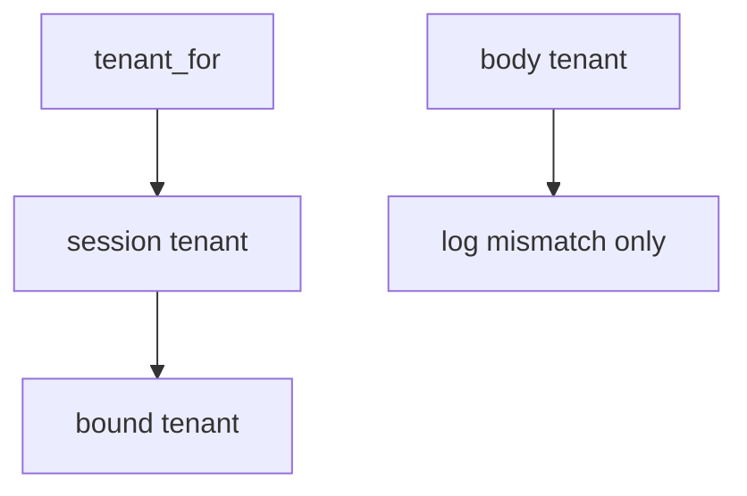

# E5-LO-04 — Bind tenant from the session

**Kind:** design-exercise
**Loop step:** 4 Build
**Standards:** ASVS 5.0.0 (final) `v5.0.0-8.2.1`, `v5.0.0-8.2.2`.

## Structural means the runtime ignores the body field for isolation

`tenant_for` must return `session["tenant"]`. Fail-safe: a lying body cannot switch workspace. RLS may *accompany* this binding; it must not be `SET` from the body.

## Mental model: session gate



Do not accept "we enabled RLS" as membership in the session.

## Why this restores the cell

| After the fix | Must be true |
|---|---|
| session A, body B | A |
| session A, body A | A |

## What this is not

Zanzibar. IAM at scale. Subdomain routing. Gate 7 / M2. Immediate grant-change (`v5.0.0-8.3.2` Level 3 residual).

If the body tenant disagrees with the session, **log** `body_tenant_mismatch` and still use the session. Do not "repair" by trusting the body.

## Practice

Name who can mint the session tenant. Run:

```
python3 -m pytest labs/E5/e5-lab/tests --impl fixed
```

Must pass.

## Transfer

Clinic: ignore `org_id` in JSON the same way.

## Residual risk

Copies keyed without tenant; silent impersonation; honest super-admin.
