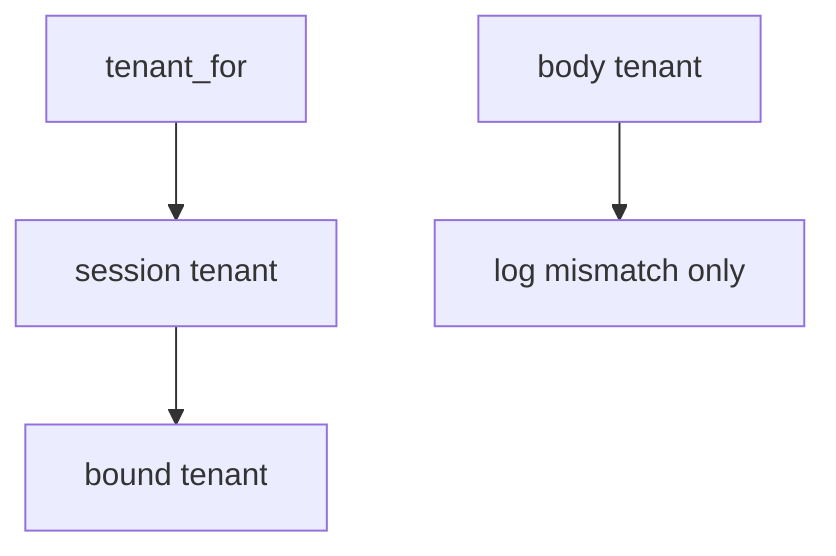

# Bind the company from the session

**Kind:** design-exercise
**Loop step:** 4 Build

## The rule

Prior company ids are not the session tenant. Hiding the company picker does not bind `tenant_for`. Turning on row-level rules does not bind the tenant. Trusting a mismatch because the body “looks honest” still fails.

What has to change: `tenant_for` **returns `session["tenant"]`**. Put simply, the runtime ignores the body field for isolation. Bind tenant from the session. Fail closed: a lying body cannot switch company. Row-level rules may *accompany* this binding; they must not be `SET` from the body. Read it as session win — not a subdomain, not a relationship-graph tuple, not a famous-bugs mapping.

Restore notes with this: session A, body B → A. Do not count it as a pass because “row-level rules are on.” Do not “repair” a mismatch by trusting the body. The JSON body is not the tenant.

## Picture: session gate



Do not accept “we enabled row-level rules” as membership in the session. Search, cache, and lake copies still have to *include* the company — a note id without company is a sibling grain. Honest super-admin impersonation is a later audited path, not a body field. Applying grant changes immediately is advanced — not this check.

If the body company disagrees with the session, **log** `body_tenant_mismatch` and still use the session.

Isolation has to be enforced — body-vs-session.

## What the repaired files must show

| After the fix | Must be true |
|---|---|
| session A, body B | A |
| session A, body A | A |

## What this is not

A relationship-graph product. Identity-at-scale as a substitute. Subdomain routing. A course gate. Immediate grant-change leftover. Row-level rules as what you trust.

## What the tool cannot do

- Search, cache, and lake keys without company remain copies.
- Silent impersonation is leftover, not this session bind.
- GraphQL `org_id` is the same field under another name.
- A JWT `org` copied from the client is the same bug.
- A row-level variable set from the body reintroduces the break in SQL.

## Practice

Name who can mint the session company. Run:

```text
python3 -m pytest labs/E5/e5-lab/tests --impl fixed
```

## Use it somewhere new

Ignore `org_id` in JSON the same way. Bind the company from the session.

## What can still go wrong

Copies keyed without company; silent impersonation; honest super-admin; immediate grant-change leftover.

## What this page is not doing

Do not probe a live company. A row-level screenshot does not mark you finished. Do not present a famous-bugs list as the syllabus.
