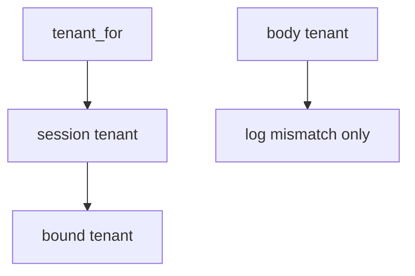

# E5-LO-04 — Bind tenant from the session

**Kind:** design-exercise
**Loop step:** 4 Build
**Standards:** ASVS 5.0.0 (final) `v5.0.0-8.2.1`, `v5.0.0-8.2.2`. `v5.0.0-8.3.2` is **Level 3, advanced**. `v5.0.0-15.3.3` related.

## Structural means the runtime ignores the body field for isolation

`tenant_for` must return `session["tenant"]`. Fail-safe: a lying body cannot switch workspace. RLS may *accompany* this binding; it must not be `SET` from the body. Structural means that session win — not a subdomain, not a Zanzibar tuple, not API1 mapped.

The smallest restore for SecureCollab notes is: session A, body B → A. Do not fail open because “RLS is on.” Do not “repair” a mismatch by trusting the body.

## Mental model: session gate



Do not accept "we enabled RLS" as membership in the session. Production still needs copies (search, cache, lake) to *include* the tenant — a note id without tenant is a sibling grain (`v5.0.0-14.2.3` if cited). Honest super-admin impersonation is E6-audited, not a body field. `v5.0.0-8.3.2` (immediate grant change) is Level 3 advanced.

If the body tenant disagrees with the session, **log** `body_tenant_mismatch` and still use the session.

ASVS `v5.0.0-8.2.2` wants isolation enforced. This pytest is that sentence for body-vs-session.

## Why this restores the cell

| After the fix | Must be true |
|---|---|
| session A, body B | A |
| session A, body A | A |

## What this is not

Zanzibar. IAM at scale. Subdomain routing. Gate 7 / M2. Immediate grant-change (`v5.0.0-8.3.2` Level 3 residual). RLS as the TCB.

## Mechanism limits

- Search/cache/lake keys without tenant remain copies.
- Silent impersonation is not this predicate.
- GraphQL `org_id` is the same field under another name.
- JWT `org` copied from the client is the same bug.
- RLS-from-body reintroduces the break in SQL.

## Practice

Name who can mint the session tenant. Run:

```text
python3 -m pytest labs/E5/e5-lab/tests --impl fixed
```

Must pass. Run from the lab directory if collection at repo root is polluted.

## Transfer

Clinic: ignore `org_id` in JSON the same way.

## Residual risk

Copies keyed without tenant; silent impersonation; honest super-admin; `v5.0.0-8.3.2` Level 3.

## Non-goals

Do not probe a live tenant. Do not claim Gate 7 from an RLS screenshot. Do not present API1 as the syllabus.
