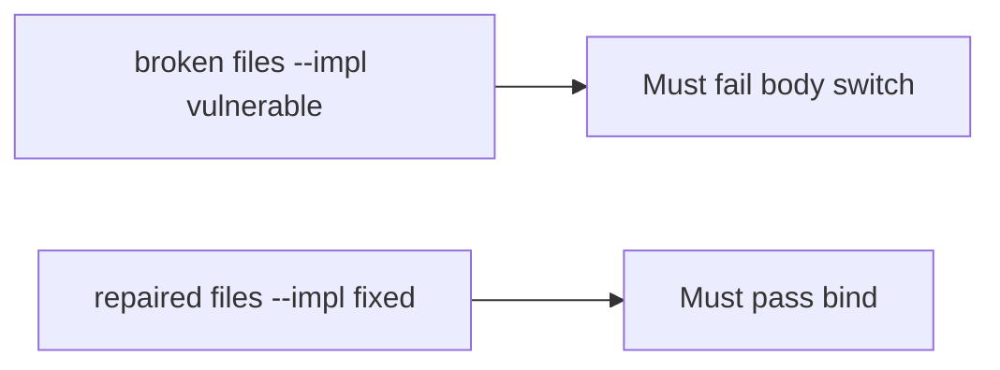

# The broken files must fail when the body switches company

**Kind:** verification-lab
**Loop step:** 5 Verify

## Check it

Row-level rules in the database do not bind tenant from the session. Mapping a famous-bugs list is a spreadsheet. `tenant_for({"tenant": "A"}, {"tenant": "B"})` has to equal `"A"`, and matching A/A may keep A. The JSON body is not the tenant. On the broken files the body tenant overrides the session (returns B). On the repaired files tenant comes from the session. Do not hit public companies.

## Picture: broken must fail: body switch

A check that only counts how many row-level rules exist can still hide that a body-chosen company still wins.



| Mode | Must show for this topic |
|---|---|
| Wrong input / abuse | session A, body B → A; broken files must fail |
| Normal | session A, body A → A (may pass on both) |
| Not claimed | relationship graph; famous-bugs dashboard; course gate; search/cache keys |

`test_body_cannot_switch_tenant` is there so body-wins `tenant_for` still fails.

```text
python3 -m pytest labs/E5/e5-lab/tests --impl vulnerable
python3 -m pytest labs/E5/e5-lab/tests --impl fixed
```

A query that stays in the same company may pass on both sides. You still have to deny a body that switches company. If the broken files do not fail `test_body_cannot_switch_tenant`, the lab is miswired — fix the wiring, not the assertion. A setup error is not proof the rule holds.

## What the tests do not prove

- Search, cache, and lake keys include company
- Impersonation is audited (later topic)
- Grant changes are immediate (advanced)
- GraphQL aliases are gone (extra writable fields)
- A course gate is complete

## Practice

Do not treat a grep for `ENABLE ROW LEVEL SECURITY` as the check. Call `tenant_for({"tenant": "A"}, {"tenant": "B"})`.

## Use it somewhere new

Asserting “row-level rules are on” is not this check. Do not use a live clinic system.

## What this page is not doing

Do not treat a live company screenshot as proof. Do not log note bodies. Answer keys are not on this site. This site does not mark you as finished.
