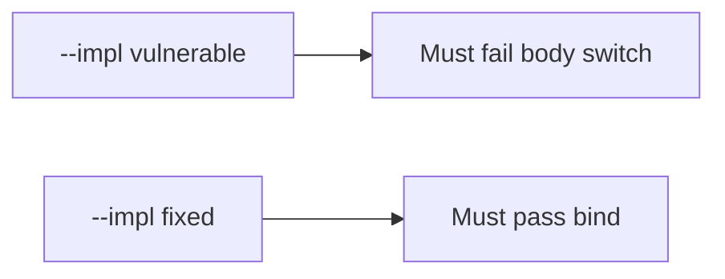

# E5-LO-05 — Evidence is body switch denied, then a passing pair

**Kind:** verification-lab
**Loop step:** 5 Verify
**Standards:** ASVS `v5.0.0-8.2.1`. API1 awareness after the cause, not the oracle.

## An invariant that cannot fail a test is still a slogan

"We have RLS" is not evidence. "API1 is mapped" is a mechanism observation. The oracle is: `tenant_for({"tenant": "A"}, {"tenant": "B"}) == "A"` and matching A/A may keep A. The body-switch observation must be **false** on `--impl vulnerable` (returns B) and **true** on `--impl fixed`. Do not hit public tenants.

## Mental model: vulnerable must fail: body switch

The failing observation on `--impl vulnerable` is **body switch**. A passing collection count is not this cell.



| Mode | Must show for this module |
|---|---|
| Negative / abuse | session A, body B → A; vulnerable must fail |
| Normal | session A, body A → A (may pass on both) |
| Not claimed | Zanzibar; API1 dashboard; Gate 7; search/cache keys |

Lab tests in `labs/E5/e5-lab/tests/test_property.py`. `test_body_cannot_switch_tenant` is a **forbidden-outcome** test: body-wins `tenant_for` is not allowed to count as a passing control.

```text
python3 -m pytest labs/E5/e5-lab/tests --impl vulnerable
python3 -m pytest labs/E5/e5-lab/tests --impl fixed
```

Honest matching-tenant tests may pass on both implementations. That does not excuse the body-switch deny test. If vulnerable does not fail `test_body_cannot_switch_tenant`, the lab is miswired—fix the wiring, not the assertion.

## What the tests do not prove

- Search/cache/lake keys include tenant
- Impersonation is audited (E6)
- Grant changes are immediate (`v5.0.0-8.3.2` Level 3)
- GraphQL aliases are gone (7.1)
- Gate 7 / M2 complete

Record those as residuals or later modules, not as silent passes.

## Practice

Execute both implementations this session from the lab directory if needed. Write the fail/pass pair next to the matrix row. Reject a “test” that only greps `ENABLE ROW LEVEL SECURITY` without calling `tenant_for({"tenant": "A"}, {"tenant": "B"})`.

## Transfer

Clinic: a test that only asserts "RLS is on" is not this cell. A live EHR is out of scope.

## Non-goals

Do not add a live-tenant trophy. Do not log note bodies. Keys stay out of this file. Gate 7 stays not-attempted.
