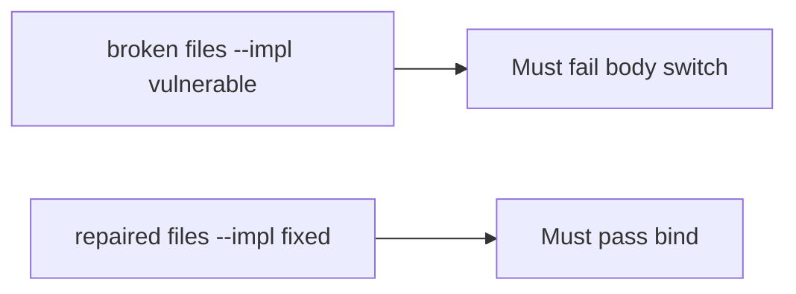

# The broken files must fail when the body switches company

**Kind:** verification-lab
**Loop step:** 5 Verify

## Check it

“We have row-level rules” is not evidence. “A famous-bugs list is mapped” is a tool observation. The check is: `tenant_for({"tenant": "A"}, {"tenant": "B"}) == "A"` and matching A/A may keep A. The JSON body is not the tenant. The body-switch observation must be **false** on the broken files (returns B: body tenant overrides session) and **true** on the repaired files (bind tenant from the session). Do not hit public companies.

## Picture: broken must fail: body switch

A check that only counts how many row-level rules exist can still look green while a body-chosen company still wins.



| Mode | Must show for this topic |
|---|---|
| Wrong input / abuse | session A, body B → A; broken files must fail |
| Normal | session A, body A → A (may pass on both) |
| Not claimed | relationship graph; famous-bugs dashboard; course gate; search/cache keys |

The file is `labs/E5/e5-lab/tests/test_property.py`. `test_body_cannot_switch_tenant` is there so body-wins `tenant_for` cannot sneak through.

```text
python3 -m pytest labs/E5/e5-lab/tests --impl vulnerable
python3 -m pytest labs/E5/e5-lab/tests --impl fixed
```

Honest matching-company tests may pass on both implementations. That does not excuse the body-switch deny test. If the broken files do not fail `test_body_cannot_switch_tenant`, the lab is miswired — fix the wiring, not the assertion. A setup error is not proof the rule holds.

## What the tests do not prove

- Search, cache, and lake keys include company
- Impersonation is audited (later topic)
- Grant changes are immediate (advanced)
- GraphQL aliases are gone (extra writable fields)
- A course gate is complete

## Practice

```text
python3 -m pytest labs/E5/e5-lab/tests --impl vulnerable
python3 -m pytest labs/E5/e5-lab/tests --impl fixed
```

Write fail or pass next to the table row. Reject a “test” that only greps `ENABLE ROW LEVEL SECURITY` without calling `tenant_for({"tenant": "A"}, {"tenant": "B"})`.

## Use it somewhere new

A clinic example: a test that only asserts “row-level rules are on” is not this rule. A live clinic system is out of scope.

## What this page is not doing

Do not treat a live company screenshot as proof. Do not log note bodies. Answer keys are not on this site. This site does not mark you as finished.
