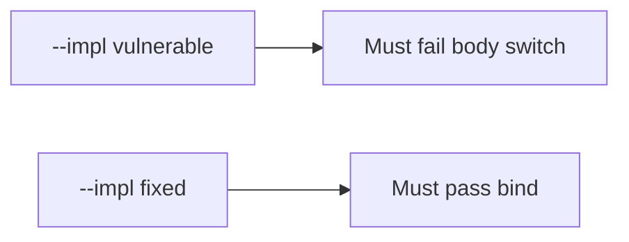

# E5-LO-05 — Evidence is body switch denied, then a passing pair

**Kind:** verification-lab
**Loop step:** 5 Verify
**Standards:** ASVS `v5.0.0-8.2.1`.

## An invariant that cannot fail a test is still a slogan

"We have RLS" is not evidence. The oracle is the local pair. Do not hit public tenants.

## Mental model: fail-on-vulnerable, pass-on-fixed



| Case | Must show |
|---|---|
| Negative / abuse | session A, body B → A |
| Normal | session A, body A → A |
| Not claimed | Zanzibar; API1 dashboard; Gate 7 |

```
python3 -m pytest labs/E5/e5-lab/tests --impl vulnerable
python3 -m pytest labs/E5/e5-lab/tests --impl fixed
```

Honest matching-tenant tests may pass on both.

## What the tests do not prove

- Search/cache/lake keys include tenant (`v5.0.0-14.2.3`)
- Impersonation is audited (E6)
- Grant changes are immediate (`v5.0.0-8.3.2` Level 3)

## Practice

Execute both implementations. Map each test to an LO-02 cell.

## Transfer

Clinic: a test that only asserts "RLS is on" is not this cell.
