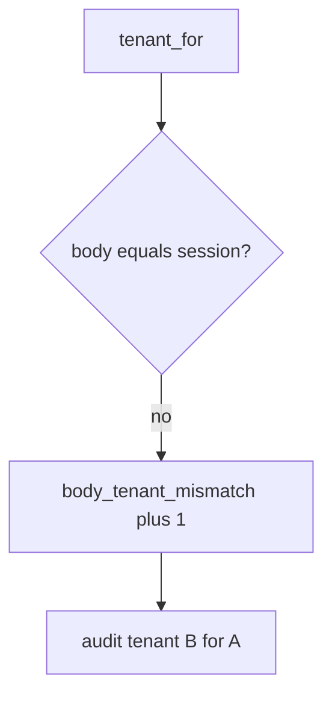

# E5-LO-06 — Detect body_tenant_mismatch without logging note bodies

**Kind:** operations-exercise
**Loop step:** 6 Operate
**Standards:** NIST CSF 2.0 (final) DE/RS/RC as outcome labels; ASVS `v5.0.0-8.2.1`.

## Prevention is not absolute

A new GraphQL field can reintroduce the body tenant after the binding was "set once." Pair detect and recover. Do not log note bodies (3.1 / 8.5). Do not paste the chart note into the ticket.

## Mental model: disagreeing body is a signal



| Outcome | This module |
|---|---|
| Detect | `body_tenant_mismatch` |
| Signal | session tenant, body tenant, actor id; never note body |
| Recover | Audit B; revoke confused session |
| Residual | Copies; silent impersonation; GraphQL aliases |

CSF 2.0 Detect / Respond / Recover name outcomes. They do not prove `v5.0.0-8.2.1`. An RLS-vendor name is not the property. Re-run `test_body_cannot_switch_tenant` after any query-layer change; a green “RLS on” tile is not that pytest. Search/cache/lake copies are the same family — inventory them before claiming Recover.

## Framework defaults versus the operate guarantee

A Zanzibar dashboard will show tuple counts and stay silent when CI’s `tenant_for` prefers the body. Detection must observe **session A plus body B is A**, not “RLS is enabled.” If the alert includes a note body or a GraphQL document dump, you have opened a 3.1 cell.

## Practice

Write one log line you would accept. Tie it to `labs/E5/e5-lab`.

```text
log_denied reason=body_tenant_mismatch session=A body=B actor=alice
```

Reject any line that includes a note body, a GraphQL document dump, or "Gate 7 complete."

## Transfer

Clinic: deny the `org_id` switch; do not paste the chart note into the ticket. Do not probe a live tenant.

## Usability

If support impersonation exists, the UI must not look like the clinician's own org (WCAG 2.2 Success Criterion 4.1.3: say *acting as*). That is E6-audited, not a body field.

Cause vs impact stays split here too: the **cause** is client-chosen tenant treated as binding; the **impact** is cross-tenant read/write; **prevention** is session win; **detection** is `body_tenant_mismatch`; **recovery** is audit-and-revoke. Mechanism limit: this alert does not prove cache keys include tenant and does not make grant change immediate (`v5.0.0-8.3.2`).

## Non-goals

An RLS-vendor name is not the property. M2 stays not-attempted. API1 is not this alert.
