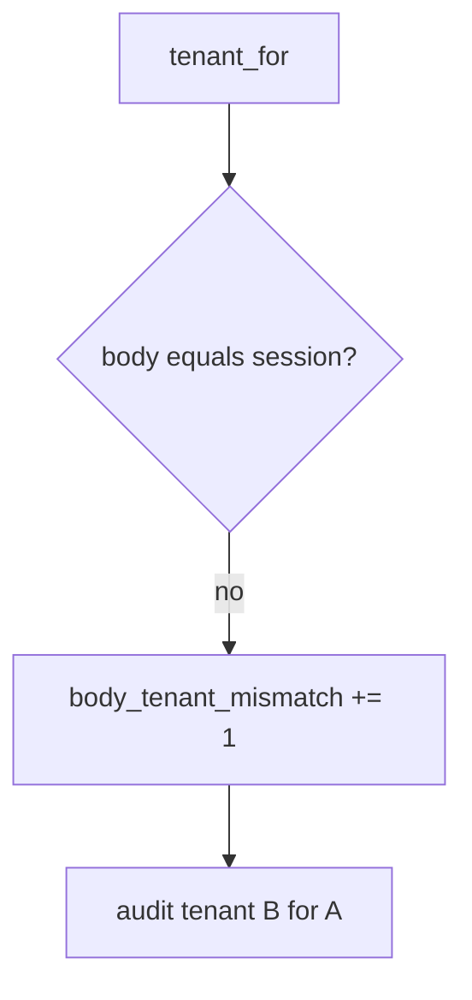

# E5-LO-06 — Detect body_tenant_mismatch without logging note bodies

**Kind:** operations-exercise
**Loop step:** 6 Operate
**Standards:** NIST CSF 2.0 (final) DE/RS/RC as outcome labels; ASVS `v5.0.0-8.2.1`.

## Prevention is not absolute

A new GraphQL field can reintroduce the body tenant after the binding was "set once." Pair detect and recover. Do not log note bodies (3.1 / 8.5).

## Mental model: disagreeing body is a signal



| Outcome | This module |
|---|---|
| Detect | `body_tenant_mismatch` |
| Signal | session tenant, body tenant, actor id; never note body |
| Recover | Audit B; revoke confused session |
| Residual | Copies; silent impersonation |

## Practice

Write one log line you would accept. Tie it to `labs/E5/e5-lab`.

```
log_denied reason=body_tenant_mismatch session=A body=B actor=alice
```

Reject any line that includes a note body, a GraphQL document dump, or "Gate 7 complete."

## Transfer

Clinic: deny the `org_id` switch; do not paste the chart note into the ticket.

## Non-goals

An RLS-vendor name is not the property. M2 stays not-attempted.
