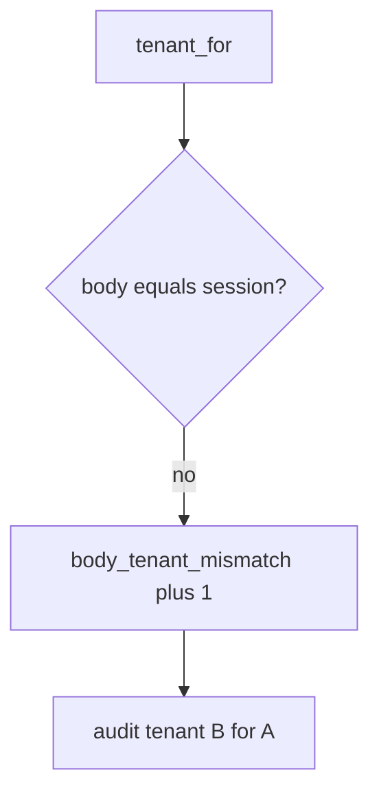

# Log the company mismatch, not the note

**Kind:** operations-exercise
**Loop step:** 6 Operate

## Fixing it once is not enough

A new GraphQL field can reintroduce the body company after the binding was “set once.” Do not log note bodies. Do not paste the chart note into the ticket.

The JSON body is not the tenant. If body tenant overrides session, you still bind tenant from the session — and you count the disagreement.

## Picture: disagreeing body is a signal



| Outcome | This topic |
|---|---|
| Notice | `body_tenant_mismatch` |
| What the line holds | session company, body company, actor id; never note body |
| Recover | Audit B; take back the confused session |
| Leftover | Copies; silent impersonation; GraphQL aliases |

A row-level vendor name does not prove company isolation. Re-run `test_body_cannot_switch_tenant` after any query-layer change; a green “row-level rules on” tile is not that check. Search, cache, and lake copies are the same family — inventory them before you claim recover.

## What the framework does vs what you still have to check

A relationship-graph dashboard will show tuple counts and stay silent when CI’s `tenant_for` prefers the body. Notice must observe **session A plus body B is A**, not “row-level rules are enabled.” If the alert includes a note body or a GraphQL document dump, you have opened a logging hole.

## Can people still use it

If support impersonation exists, the UI must not look like the clinician’s own company. Say *acting as* in text a screen reader can speak. That is a later audited path, not a body field.

Why it happens vs what it costs stays split here too: the **cause** is client-chosen company treated as binding; the **cost** is read or write into another company; **how you stop it** is session win; **how you notice** is `body_tenant_mismatch`; **how you recover** is audit-and-revoke. What the tool cannot do: this alert does not prove cache keys include company and does not make grant change immediate.

## Practice

```text
log_denied reason=body_tenant_mismatch session=A body=B actor=alice
```

Reject any line that includes a note body, a GraphQL document dump, or “course gate complete.”

## Use it somewhere new

A clinic example: deny the `org_id` switch; do not paste the chart note into the ticket. Do not probe a live company.

## What this page is not doing

A row-level vendor name is not the rule. This site does not mark you as finished. A famous-bugs list is not this alert. Answer keys are not on this site.
