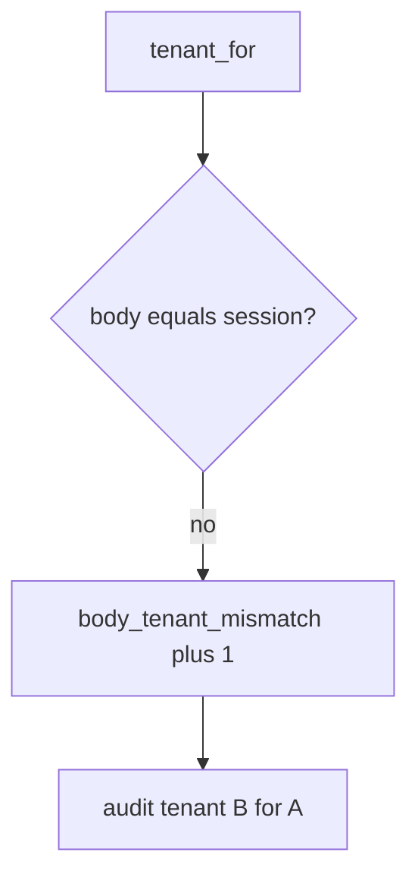

# Log the company mismatch, not the note

**Kind:** operations-exercise
**Loop step:** 6 Operate

## Fixing it once is not enough

A new GraphQL field can reintroduce the body company. Keep note bodies and the chart note out of the ticket.

The JSON body is not the tenant. If body tenant overrides session, you still bind tenant from the session — and you count the disagreement.

## Picture: disagreeing body is a signal



| Outcome | This topic |
|---|---|
| Notice | `body_tenant_mismatch` |
| What the line holds | session company, body company, actor id; never note body |
| Recover | Audit B; take back the confused session |
| Leftover | Copies; silent impersonation; GraphQL aliases |

A row-level vendor name does not prove company isolation. Body tenant B still has to fail `test_body_cannot_switch_tenant`. Turning row-level rules on does not stop a body switch. Search, cache, and lake copies still take company from the body; companies are not apart until those copies are named.

## What the framework does vs what you still have to check

A relationship-graph dashboard will show tuple counts and stay silent when CI’s `tenant_for` prefers the body. Notice must observe **session A plus body B is A**, not “row-level rules are enabled.” The metric is session A plus body B is A. A note body or a GraphQL document dump is the chart.

## Can people still use it

If support impersonation exists, the UI must not look like the clinician’s own company. Say *acting as* in text a screen reader can speak. That is a later audited path, not a body field.

The failed decision is client-chosen company treated as binding. The leftover harm is read or write into another company. The repair is session win. The signal is `body_tenant_mismatch`. Recover by audit-and-revoke. Logging does not prove cache keys include company and does not make grant change immediate.

## Practice

```text
log_denied reason=body_tenant_mismatch session=A body=B actor=alice
```

`body_tenant_mismatch` already names session and body. A note body, a GraphQL document dump, and “course gate complete” are extra copies of the chart.

## Use it somewhere new

Deny the `org_id` switch; do not paste the chart note into the ticket. Do not probe a live company.

## What this page is not doing

A row-level product does not bind company from the session. This site does not mark you as finished. A famous-bugs list does not stop a body switch. Answer keys are not on this site.
