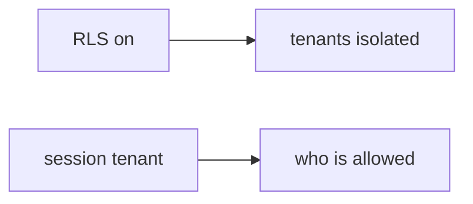

# Same idea when a clinic puts org_id in JSON

**Kind:** transfer-challenge
**Loop step:** 7 Transfer

## Use it somewhere new

The notes-app scaffolding goes away. You get a **clinic sketch** with group practices and an `org_id` in JSON. Your job is to rewrite the loop, not to name a famous-bugs code.

The notes-app sentence was: `tenant_for({"tenant": "A"}, {"tenant": "B"})` must be `"A"`. The JSON body is not the tenant. Rewrite it for a clinic without changing the fork: bind tenant from the session; body tenant overrides session must stay false.

**Prompt:** Clinic group practice switching `org_id` in JSON. Also name a relationship-graph tuple vs this binding.

**Product sketch:** clinic-lite “PostgreSQL row-level rules are on so companies are done,” plus “we mapped a famous-bugs list so isolation is done.”

## Picture: row-level sticker vs binding

If row-level rules are “on” while `tenant_for` prefers the body, the rule is gone. A relationship-graph tuple store and a famous-bugs mapping do not put session A in what you trust. GraphQL `org_id` is the same field. Name them, do not probe a live clinic here. Famous-bugs lists are a regression label *after* the body-wins cause, not the syllabus. Immediate grant-change leftover is advanced: in-session grant change, not this check.

The clinic rewrite still has to keep the notes-app fork: session A plus body B is A, matching A/A may keep A. Enabling row-level rules without session binding leaves `tenant_for({A},{B}) == B`. The local pytest analogue is `test_body_cannot_switch_tenant` — on a practice, not a live clinic system.

## Prompt — clinic sketch

Rewrite the notes-app sentence. Include:

1. who can act (member of practice A sending practice B — not a live clinic company);
2. what you trust (session binding is trusted; a row-level variable from the body, a famous-bugs mapping, and a subdomain are not);
3. what must not happen (`tenant_for({A},{B}) == B`, not a legal label);
4. a test idea on a **local** practice files only (no public clinic system);
5. leftover (search/cache/lake, silent impersonation, immediate grant-change leftover);
6. whether a support impersonation UI exists (must not look like the clinician’s own company; announce *acting as* in text).

## What is not good enough

| Reject | Why |
|---|---|
| “we have row-level rules / a relationship graph” | Not this binding |
| Live clinic GraphQL | Course rules |
| “famous-bugs mapped so who-is-allowed is done” | Awareness after the cause |
| “subdomain is the company” | Client-controlled Host |
| “course gate complete” | Forbidden stamp |

## Practice

One page. No answer keys. `labs/E5/e5-lab` is the only running system you may break. Do not probe a live company.

## What this page is not doing

Live-product probes. Production GraphQL. Claiming a course gate from this page.
